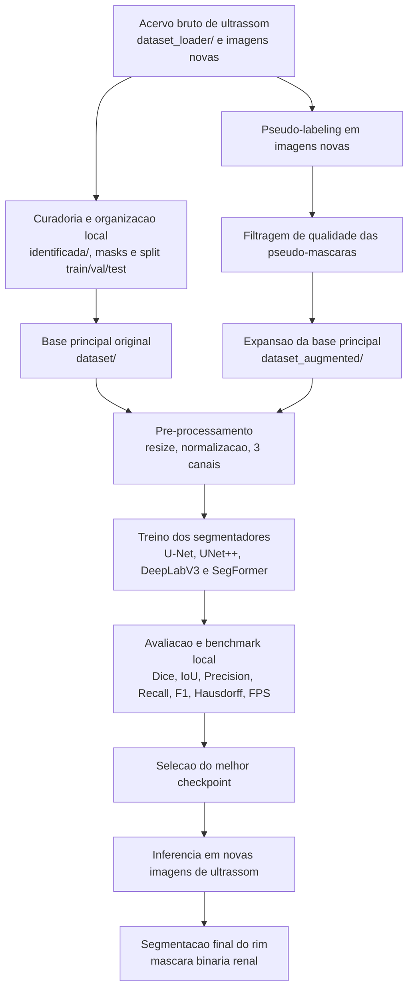

# Segmentacao Renal e Caracterizacao Ultrassonografica Intrarrenal

Este projeto investiga o uso de visao computacional e aprendizado profundo em imagens de ultrassonografia renal. A versao atual da pesquisa foca em segmentar o rim e estruturas intrarrenais anotadas, extraindo marcadores exploratorios de ecogenicidade e textura.

O estado atual do projeto ja resolve uma etapa importante: a segmentacao automatica do rim. A proposta transforma essa segmentacao em uma etapa intermediaria de um *pipeline* maior, no qual a mascara renal delimita a regiao de analise antes da extracao de medidas internas. Fibrose renal nao e um rotulo demonstrado na base atual: a literatura a relaciona principalmente a `interstitial fibrosis and tubular atrophy` (`IFTA`) avaliada em biopsia, e faltam imagens vinculadas a esse padrao de referencia.

## Organizacao Atual dos Dados

A raiz mantem apenas `dataset_inicial/`, com os splits originais, e
`dataset_aumentado/`, com fontes adicionais, `dataset_geral`, conjuntos
derivados e a planilha de curadoria. A estrutura vigente e o dicionario da
planilha estao descritos em:

```text
docs/organizacao_datasets_curadoria.md
```

## Objetivo Atual

O objetivo do projeto nao e mais apenas localizar o rim na imagem.

O objetivo passou a ser:

1. segmentar o rim com boa precisao;
2. usar essa mascara para isolar o orgao;
3. segmentar a classe anatomica `Medulla` e estender a analise para `Cortex`;
4. medir intensidade, textura e contraste cortico-medular dentro do rim;
5. comparar, quando possivel, a ecogenicidade cortical com a de orgaos proximos, como figado ou pancreas;
6. preparar atributos para caracterizacao exploratoria de alteracao parenquimatosa.

Na versao do artigo, a etapa 6 ainda nao e apresentada como classificador final.
Ela e uma prova de conceito sobre um subconjunto pequeno, enquanto a contribuicao
principal consolidada esta na segmentacao renal e na preparacao de medidas
intrarrenais.

## Artigo SBBD

A versao final do artigo esta em:

```text
artigo/SBBD_2026___Jefferson/
```

Arquivos principais:

```text
main.tex
main.pdf
sbc-template.bib
sbc-template.sty
sbc.bst
caption2.sty
figures/
```

Figuras usadas no artigo:

```text
figures/example_reference_high_ratio_1.png
figures/quality_good_comparison.png
figures/example_predicted_diseased_1.png
```

O PDF final possui 7 paginas. As 6 primeiras contem o texto do artigo, tabelas e
figuras; a pagina 7 contem apenas as referencias.

## Motivacao Clinica

Na ultrassonografia, alteracoes renais podem apresentar sinais visuais no parenquima, como:

- aumento de brilho difuso;
- presenca de muitos pontos brancos;
- alteracao de contraste interno;
- mudanca relativa de ecogenicidade em comparacao com estruturas adjacentes.

Dentro da proposta deste projeto, esses sinais serao investigados de forma computacional a partir da segmentacao do rim e da analise das suas estruturas internas. Sem rotulo de biopsia ou validacao clinica correspondente, esses marcadores nao devem ser denominados deteccao de fibrose.

## Estado Atual

O projeto ja possui:

- dataset organizado em `train`, `val` e `test`;
- mascaras binarias do rim;
- pipeline de treinamento para segmentacao semantica;
- benchmark entre multiplas arquiteturas;
- scripts de visualizacao e avaliacao;
- pseudo-labeling para ampliar a base com novas mascaras do rim.

O projeto agora tambem possui:

- extracao automatica de features intrarrenais;
- mascara interna candidata por heuristica;
- mascaras manuais de `Medulla` extraidas das anotacoes multiclasse do `kidneyUS`;
- segmentadores iniciais de medula e geracao controlada de pseudo-mascaras;
- exportacao de CSV para analise quantitativa da ROI renal;
- suporte a mascara manual de orgao de referencia, como figado.

O projeto ainda nao possui:

- conjunto ampliado de mascaras de medula revisadas para retreinamento;
- rotulos clinicos ou histologicos de IFTA/fibrose;
- classificador final de rim saudavel versus rim doente;
- comparacao automatica com figado ou pancreas;
- metrica final clinica para a nova tarefa.

## Proximos Passos

A proxima etapa metodologica sera ampliar o modelo intrarrenal. Esse modelo
usara a mascara gerada pelo segmentador DeepLab campeao para isolar a ROI renal
e analisar `Medulla`, `Cortex`, ecogenicidade e diferenciacao
cortico-medular.

Esse terceiro modelo nao deve ser apresentado como diagnostico direto de
fibrose. Com os dados atuais, sua saida e a quantificacao exploratoria de
marcadores ultrassonograficos parenquimatosos. Uma etapa de predicao de IFTA
dependera de imagens vinculadas a biopsia ou a referencia clinica validada.

Plano detalhado: `docs/proximos_passos_modelo_intrarrenal.md`.
Pipeline atualizado de rim, medula e opacidade:
`docs/pipeline_rim_medula_opacidade.md`.
Revisao medico-metodologica sobre fibrose e IFTA:
`docs/revisao_medico_metodologica_fibrose.md`.

Quando houver uma ROI manual do figado, o projeto ja consegue comparar rim e figado de forma quantitativa.

## Estrutura do Projeto

```text
D:\kidney
|-- dataset/
|   |-- train/
|   |   |-- image/
|   |   `-- mask/
|   |-- val/
|   |   |-- image/
|   |   `-- mask/
|   `-- test/
|       |-- image/
|       `-- mask/
|-- dataset_loader/
|-- models/
|-- results/
|-- src/
|   `-- segmentation/
|       |-- build_dataset_geral.py
|       |-- core/
|       |-- experiments/
|       `-- tools/
|-- utils/
|   `-- renal_features.py
|-- artigo/
|-- src\segmentation\tools\benchmark_models.py
|-- src\segmentation\tools\evaluate_models.py
|-- engenharia_dataset/
|   |-- README.md
|   |-- download_monai_renal_subset.py
|   |-- curate_monai_renal_dicoms.py
|   |-- download_kaggle_datasets.py
|   |-- expand_dataset_from_loader.py
|   |-- extract_renal_features.py
|   `-- annotate_reference_roi.py
|-- src\segmentation\tools\generate_prediction_samples.py
|-- run_pipeline.py
|-- train_renal_classifier.py
|-- src\segmentation\tools\visualizar_resultados.py
`-- Readme.md
```

`engenharia_dataset/` concentra os scripts de download, curadoria, conversao,
pseudo-rotulacao, extracao de features e preparacao de rotulos. Essa separacao
mantem a engenharia da base de dados distinta dos scripts de treino, avaliacao e
escrita do artigo.

`src/segmentation/` concentra o codigo de segmentacao: datasets, losses,
metricas, carregamento de modelos, treino, avaliacao, comparativos e montagem do
`dataset_geral`.

## Dataset

O dataset atual foi preparado para segmentacao do rim, nao para segmentacao interna nem para classificacao de fibrose.

## Engenharia de Dataset

Os scripts de tratamento e manipulacao de dados foram agrupados em
`engenharia_dataset/`. O fluxo adotado para bases externas sem mascaras manuais
e:

```text
zip bruto MONAI
-> extrair DICOMs
-> converter so frames uteis para PNG
-> filtrar imagens renais B-mode
-> gerar pseudo-mascaras
-> manter PNG + mascara + manifesto
-> apagar DICOM/zip bruto se tudo estiver validado
```

No MONAI/NVIDIA, a curadoria foi executada em lotes sucessivos ate esgotar os
`238` estudos renais/retroperitoneais candidatos. Ao todo, aproximadamente
`68,82 GB` de zips brutos foram baixados temporariamente e reduzidos para
`4.487` imagens PNG curadas, com cerca de `676 MB` no total processado. Os zips
brutos foram removidos depois de cada conversao, mantendo PNGs, metadados e
manifestos.

Documentacao especifica:

- `engenharia_dataset/README.md`
- `docs/downloaded_external_data.md`
- `docs/narrativa_engenharia_dataset.md`

## Dataset Geral

A pasta `dataset_geral/` consolida as imagens disponiveis e as mascaras aceitas
no formato:

```text
dataset_geral/
    imagens/
    mascaras/
    manifest.csv
    summary.json
    relatorios/
```

O manifesto informa, para cada imagem, se a mascara ja existia, se foi gerada e
aceita, ou se foi rejeitada por nao atingir os criterios de qualidade.

Comando:

```powershell
.\.venv\Scripts\python.exe src\segmentation\build_dataset_geral.py --clear-output --confidence-threshold 0.90
```

Estado atual da ultima montagem:

- `5.994` imagens unicas;
- `1.001` mascaras existentes copiadas;
- `2.961` pseudo-mascaras geradas e aceitas;
- `2.032` imagens ainda sem mascara aceita;
- `3.962` imagens com mascara em `dataset_geral/mascaras/`.

A confianca de `0.90` e um criterio operacional do modelo e dos filtros de
qualidade. Ela nao substitui revisao humana, mas impede que mascaras fracas
entrem automaticamente na base geral.

## Proveniencia dos Dados

As imagens utilizadas neste repositorio foram organizadas localmente a partir de material recebido no arquivo `flood_1.zip`. Conforme a comunicacao recebida junto ao compartilhamento desse arquivo, o conjunto de imagens usado no estudo tem como origem o projeto publico [The Open Kidney Ultrasound Data Set (`rsingla92/kidneyUS`)](https://github.com/rsingla92/kidneyUS), que tambem serviu como principal referencia tecnica para a etapa de segmentacao renal.

Para fins de documentacao e publicacao deste projeto, a cadeia de proveniencia dos dados e descrita da seguinte forma:

```text
Open Kidney Ultrasound Dataset (fonte publica citada pelo autor)
-> arquivo flood_1.zip recebido por e-mail
-> organizacao local em dataset_loader/, identificada/ e dataset/
-> split final train/val/test usado neste repositorio
```

Registro de procedencia local:

- a pasta `dataset/` usada neste repositorio foi montada a partir do arquivo `flood_1.zip`;
- esse arquivo foi recebido por e-mail no contexto de compartilhamento do material de pesquisa;
- a mensagem recebida informa que os dados do estudo foram obtidos do Open Kidney Ultrasound Dataset.

Caracteristicas descritas pelo acervo de referencia:

- mais de 500 imagens bidimensionais de ultrassom abdominal em modo B;
- imagens renais anotadas por especialista;
- uma imagem por paciente;
- aquisicoes clinicas realizadas entre janeiro de 2015 e setembro de 2019;
- acesso aos dados mediante registro;
- uso nao comercial, conforme a documentacao do projeto original.

### Catalogacao Local das Imagens

Catalogacao atual das pastas locais:

- `dataset_loader/`: 536 imagens PNG do acervo bruto/local de trabalho;
- `identificada/image/`: 498 imagens com identificacao consistente para anotacao;
- `identificada/mask/`: 498 mascaras binarias correspondentes;
- `kidneyUS_images_25_june_2025/`: 534 imagens PNG adicionais e 2 arquivos CSV (`reviewed_labels_1.csv` e `reviewed_labels_2.csv`) trazidos do acervo ligado ao projeto `kidneyUS`;
- `dataset/train/image/` e `dataset/train/mask/`: 360 pares imagem-mascara;
- `dataset/val/image/` e `dataset/val/mask/`: 51 pares imagem-mascara;
- `dataset/test/image/` e `dataset/test/mask/`: 102 pares imagem-mascara;
- `reference_masks/train/`: 7 mascaras manuais de orgao de referencia;
- `nao_identificada/`: 36 imagens ainda fora do split principal.

Isso significa que o split principal atualmente usado pelos scripts de treino e avaliacao contem `513` pares imagem-mascara (`360 + 51 + 102`).

### Fonte e Citacao

- repositorio: [https://github.com/rsingla92/kidneyUS](https://github.com/rsingla92/kidneyUS)
- artigo: Singla, R. et al. "The Open Kidney Ultrasound Data Set". International Workshop on Advances in Simplifying Medical Ultrasound, 2023.
- observacao de licenca: o repositorio original informa disponibilizacao sob `CC BY-NC-SA`, com restricao para uso comercial e liberacao dos dados mediante cadastro.

Formato esperado:

```text
dataset/
    train/
        image/
        mask/
    val/
        image/
        mask/
    test/
        image/
        mask/
```

Cada imagem possui:

- uma imagem de ultrassom em tons de cinza;
- uma mascara binaria delimitando o rim;
- o mesmo nome de arquivo em `image/` e `mask/`.

### Limitacao do dataset atual

Hoje a mascara marca apenas o contorno externo do rim.

Para atacar o novo problema, idealmente sera necessario adicionar pelo menos um destes tipos de anotacao:

1. mascara das piramides renais;
2. mascara de regioes suspeitas de alteracao;
3. rotulo por imagem ou por rim, como `saudavel`, `suspeito`, `doente`;
4. grau ordinal de alteracao, como `leve`, `moderado`, `grave`.

## Pipeline Atual

O pipeline implementado hoje e:

### Diagrama de fluxo ate a segmentacao final



Leitura do fluxo:

- `dataset/` representa a versao original do acervo principal.
- `dataset_augmented/` representa a versao expandida desse mesmo acervo com imagens novas e pseudo-mascaras filtradas.
- o benchmark final do projeto usa a base expandida para selecionar o checkpoint que gera a segmentacao renal final.

```text
Imagem de ultrassom
-> pre-processamento basico
-> redimensionamento
-> conversao para 3 canais
-> segmentacao do rim
-> mascara binaria do orgao
```

Esse pipeline ja atende bem a etapa de isolamento anatomico.

## Novo Pipeline Proposto

Com a redefinicao do projeto, o pipeline alvo passa a ser:

```text
Imagem de ultrassom
-> pre-processamento
-> segmentacao do rim
-> recorte da ROI renal
-> segmentacao interna das piramides renais
-> extracao de atributos de opacidade e ecogenicidade
-> comparacao com orgaos adjacentes, quando possivel
-> classificacao de rim saudavel ou com sinais de alteracao
```

## Desafio Central

O gargalo tecnico agora nao e mais encontrar o rim.

O gargalo e:

1. localizar estruturas internas do rim;
2. separar as piramides renais do restante do parenquima;
3. medir quantitativamente o quanto a regiao esta clara, heterogenea ou pontilhada;
4. transformar essa observacao visual em criterio computacional robusto.

Em termos praticos, a mascara do rim resolve a pergunta:

```text
onde esta o rim?
```

Mas a nova proposta precisa responder:

```text
como esta o interior do rim?
```

## Modelos Ja Implementados

O projeto ja possui treinamento e avaliacao para os seguintes modelos de segmentacao:

- U-Net
- U-Net++
- DeepLabV3
- SegFormer

Arquivos principais:

- `src/segmentation/experiments/train_unet.py`
- `src/segmentation/experiments/train_unetplusplus.py`
- `src/segmentation/experiments/train_deeplab.py`
- `src/segmentation/experiments/train_segformer.py`
- `src\segmentation\tools\evaluate_models.py`
- `src\segmentation\tools\benchmark_models.py`

### Inspiracao externa para segmentacao

A etapa de segmentacao renal deste repositorio foi inspirada pelo projeto `kidneyUS`, tanto pela organizacao do acervo quanto pela proposta de benchmarking em ultrassom renal. Por isso, o README agora registra explicitamente essa dependencia intelectual e a fonte das imagens.

Os scripts `src\segmentation\tools\evaluate_models.py` e `src\segmentation\tools\benchmark_models.py` tambem passaram a aceitar checkpoints externos, o que facilita testar um modelo vindo do projeto de referencia quando o arquivo de pesos estiver disponivel localmente.

O README original do projeto [kidneyUS](https://github.com/rsingla92/kidneyUS/blob/main/README.md) tambem documenta dois pontos que passaram a existir no ambiente local deste trabalho:

- um acervo em PNG acompanhado de arquivos CSV de anotacao revisada;
- pesos pre-treinados disponibilizados separadamente para os modelos publicados pelos autores.

### Arquivos adicionais do kidneyUS no ambiente local

No ambiente atual deste projeto, a pasta `kidneyUS_images_25_june_2025/` funciona como acervo complementar associado ao projeto `kidneyUS`.

Conteudo observado localmente:

- `534` imagens `.png`;
- `reviewed_labels_1.csv`;
- `reviewed_labels_2.csv`.

Esses arquivos sao coerentes com a descricao do repositorio original, que menciona imagens em PNG e arquivos de anotacao/labels associados ao conjunto de dados.

### Pesos externos do projeto de referencia

No ambiente local atual, os pesos externos do projeto de referencia estao armazenados fora deste repositorio em:

```text
E:\weights\weights
```

Estrutura identificada localmente:

- `annotator_1/`
- `annotator_2/`
- `mixed/`

Dentro dessas pastas existem checkpoints de `nnUNet`, incluindo pesos para:

- `Task001_KidneyCapsule`
- `Task002_KidneyRegions`

com folds `0` a `4` onde disponiveis, em caminhos como:

```text
E:\weights\weights\annotator_1\Task002_KidneyRegions\nnUNetTrainerV2__nnUNetPlansv2.1\fold_0\model_final_checkpoint.model
```

Observacoes importantes:

- esses pesos nao estao versionados dentro deste repositorio;
- eles pertencem ao fluxo original baseado em `nnUNet`;
- o repositorio agora possui inferencia nativa com esses pesos por meio do script `experiments/run_kidneyus_nnunet_inference.py`;
- o fluxo local reproduz a linha de segmentacao do `kidneyUS`, especialmente na tarefa `Task001_KidneyCapsule`, usando checkpoints `nnUNetTrainerV2__nnUNetPlansv2.1` em modo `2d`.

Exemplos:

```bash
python src\segmentation\tools\evaluate_models.py --model deeplab --checkpoint models\meu_modelo_externo.pth --backbone resnet50
python src\segmentation\tools\benchmark_models.py --model segformer --checkpoint models\meu_modelo_externo.pth --segformer-backbone nvidia/segformer-b0-finetuned-ade-512-512
```

Se o checkpoint externo vier acompanhado de um arquivo `.meta.json`, o projeto tambem aproveita automaticamente metadados como `best_threshold` e configuracoes de arquitetura. Exemplo:

```json
{
  "best_threshold": 0.5,
  "model_kwargs": {
    "backbone": "resnet50"
  }
}
```

## Parte Tecnica

### Pre-processamento atual

O projeto aplica, dependendo do script:

- resize para `256x256`;
- normalizacao para intervalo `[0, 1]`;
- replicacao do canal grayscale para 3 canais;
- remocao de bordas pretas;
- reducao de ruido com `fastNlMeansDenoising`;
- melhoria de contraste com `CLAHE`.

### Funcoes de perda

Na etapa de segmentacao do rim, a combinacao usada e:

```text
BCEWithLogitsLoss + DiceLoss
```

Essa escolha e adequada para segmentacao binaria com desbalanceamento entre fundo e objeto.

### Metricas atuais

Para segmentacao do rim, o projeto ja utiliza ou ja calcula:

- Dice Score;
- IoU;
- Precision;
- Recall;
- F1;
- Hausdorff Distance;
- FPS em benchmark.

### O que falta tecnicamente para a nova proposta

Para que o projeto fique aderente ao novo objetivo, ainda sera necessario implementar:

1. uma estrategia de segmentacao interna das piramides renais;
2. uma etapa de extracao de caracteristicas radiomicas ou estatisticas da ROI interna;
3. uma metrica de opacidade/ecogenicidade relativa;
4. uma rotina de deteccao de pontos hiperecogenicos;
5. uma logica de comparacao com figado ou pancreas, quando presentes;
6. um classificador final baseado em regras, aprendizado supervisionado ou abordagem hibrida.

### O que ja foi implementado com base na literatura

Com base em trabalhos que usam a ROI do rim como entrada para analise de textura e ecogenicidade, o projeto passou a incluir uma etapa intermediaria executavel:

- extracao de estatisticas de intensidade da mascara renal;
- extracao de estatisticas da regiao interna erodida;
- deteccao de pontos brilhantes dentro do rim;
- metricas de textura por GLCM;
- comparacao entre o rim e uma banda externa de referencia;
- comparacao entre o rim e uma ROI manual de figado, quando disponivel;
- geracao de uma mascara candidata de estruturas internas escuras compativeis com piramides.

Essa etapa nao substitui a anotacao manual das piramides, mas reduz a distancia entre a segmentacao externa atual e a classificacao final do orgao.

## Hipotese Computacional Atual

A hipotese de trabalho do projeto e:

- se o rim apresentar regiao interna excessivamente clara;
- se houver muitos pontos brancos distribuidos no interior do orgao;
- se a ecogenicidade renal estiver elevada em relacao a estruturas de referencia;

entao pode haver sinal compativel com alteracao patologica, incluindo suspeita de fibrose.

Essa hipotese ainda precisa ser validada com rotulos apropriados e criterios mais objetivos.

## Caminhos Tecnicos Possiveis Para a Etapa Interna

Existem pelo menos quatro caminhos viaveis para a proxima fase:

1. Segmentacao supervisionada das piramides.
Requer novas mascaras manuais e permite usar U-Net, DeepLab ou SegFormer tambem para a estrutura interna.

2. Segmentacao fraca ou semi-supervisionada.
Pode combinar heuristicas de intensidade, watershed, clustering ou pseudo-labeling com revisao manual.

3. Analise por textura sem segmentacao perfeita.
Depois de segmentar o rim, e possivel extrair descritores como histograma, entropia, LBP, GLCM e distribuicao de pixels brilhantes.

4. Pipeline hibrido.
Segmenta o rim com rede neural e usa regras classicas de processamento de imagem para localizar as piramides e medir opacidade.

## Comparacao Com Orgaos Adjuntos

Uma extensao importante da proposta e comparar a ecogenicidade do rim com a de outros orgaos proximos.

Na pratica, isso significa:

- detectar se figado ou pancreas aparecem no enquadramento;
- segmentar ou aproximar uma ROI desses orgaos;
- medir intensidade media, contraste e distribuicao tonal;
- comparar com a intensidade do rim ou das piramides.

Esse passo pode ser muito util, mas nao deve ser obrigatorio em todas as imagens, porque nem sempre esses orgaos estao bem visiveis.

No estado atual do projeto, a forma mais confiavel de usar essa comparacao e com anotacao manual da ROI de referencia.

## Scripts Principais

### Treinamento

- `src/segmentation/experiments/train_unet.py`
- `src/segmentation/experiments/train_unetplusplus.py`
- `src/segmentation/experiments/train_deeplab.py`
- `src/segmentation/experiments/train_segformer.py`

### Avaliacao e benchmark

- `src\segmentation\tools\evaluate_models.py`
- `src\segmentation\tools\benchmark_models.py`

### Visualizacao

- `src\segmentation\tools\generate_prediction_samples.py`
- `src\segmentation\tools\visualizar_resultados.py`
- `experiments/visual_compare_segmenters.py`

### Pseudo-labeling

- `engenharia_dataset\divisor_segmentation.py`
- `engenharia_dataset\expand_dataset_from_loader.py`

### Estudos comparativos

- `experiments/run_dataset_variant_comparison.py`
- `experiments/compare_with_kidneyus_reference.py`

### Analise intrarrenal

- `engenharia_dataset\extract_renal_features.py`
- `utils/renal_features.py`

### Anotacao de ROI de referencia

- `engenharia_dataset\annotate_reference_roi.py`

### Classificacao experimental

- `engenharia_dataset\prepare_renal_labels_template.py`
- `run_pipeline.py`
- `train_renal_classifier.py`

## Expansao do Dataset e Comparativos

O projeto agora possui um fluxo separado para:

- gerar pseudo-mascaras a partir de imagens novas em `dataset_loader/`;
- filtrar pseudo-rotulos com criterio de qualidade;
- criar uma versao expandida do mesmo acervo principal em `dataset_augmented/`, sem alterar o `dataset/` original;
- treinar e comparar modelos baseline e modelos ajustados por hiperparametros entre a versao original e a versao expandida da mesma base.

### 1. Gerar dataset aumentado

```bash
.\.venv\Scripts\python.exe engenharia_dataset\expand_dataset_from_loader.py full --clear-output
```

Saidas principais:

- `pseudo_labels/pseudo_label_report.csv`
- `dataset_augmented/pseudo_label_manifest.csv`

### 2. Rodar comparativos entre a versao original e a versao expandida da base

Para rodar todos os modelos e todas as variantes configuradas:

```bash
.\.venv\Scripts\python.exe src\segmentation\experiments\run_dataset_variant_comparison.py --dataset-variant all --model all --epochs 40
```

Para rodar apenas um modelo:

```bash
.\.venv\Scripts\python.exe src\segmentation\experiments\run_dataset_variant_comparison.py --dataset-variant all --model segformer --epochs 40
```

Para validar rapidamente o pipeline:

```bash
.\.venv\Scripts\python.exe src\segmentation\experiments\run_dataset_variant_comparison.py --dataset-variant augmented --model unet --epochs 1 --limit-runs 1
```

### 3. Metricas geradas no comparativo

O relatorio consolidado inclui, para cada execucao:

- `best_val_dice`
- `test_dice_global`
- `dice_binary_mean`
- `iou_binary_mean`
- `precision_binary_mean`
- `recall_binary_mean`
- `f1_binary_mean`
- `hausdorff_mean`
- `fps_eval`
- `best_threshold`
- diferenca para o baseline do mesmo modelo no mesmo dataset
- diferenca para a mesma configuracao rodada na versao original da base

Os arquivos finais sao salvos em `results/segmentation_experiments/` nos formatos CSV, JSON e Markdown.

### 4. Resultado da expansao do dataset

Na execucao atual do pseudo-labeling sobre `dataset_loader/`, o fluxo encontrou:

- `536` itens no acervo bruto;
- `513` imagens ja presentes no `dataset/` original;
- `23` candidatas novas reais para pseudo-rotulacao;
- `19` pseudo-mascaras aceitas apos filtragem;
- `4` itens rejeitados no processo de validacao.

Com isso, o acervo principal usado nos comparativos passou de `513` para `532` pares imagem-mascara quando considerado em sua versao expandida `dataset_augmented/`.

Distribuicao final das duas versoes do mesmo acervo:

- `dataset/`: versao original com `train=360`, `val=51`, `test=102`
- `dataset_augmented/`: versao expandida com `train=373`, `val=53`, `test=106`

### 5. Resultados comparativos atuais

Resultados consolidados gerados em `12/04/2026`:

- relatorio principal: `results/segmentation_experiments/dataset_variant_comparison.csv`
- versao JSON: `results/segmentation_experiments/dataset_variant_comparison.json`
- versao Markdown: `results/segmentation_experiments/dataset_variant_comparison.md`

Melhores resultados por familia no `dataset_augmented/`, etapa anterior usada
como referencia antes da expansao para o `dataset_geral`:

| Familia | Melhor experimento | Dice | IoU | F1 | Hausdorff | FPS |
| --- | --- | ---: | ---: | ---: | ---: | ---: |
| DeepLab | `augmented_deeplab_resnet50_baseline` | `0.8472` | `0.7732` | `0.8472` | `18.02` | `28.98` |
| SegFormer | `augmented_segformer_b2_capacity` | `0.8372` | `0.7700` | `0.8372` | `17.46` | `35.66` |
| UNet | `augmented_unet_baseline` | `0.8119` | `0.7309` | `0.8119` | `23.60` | `26.43` |
| UNet++ | `augmented_unetplusplus_baseline` | `0.7924` | `0.6958` | `0.7924` | `31.90` | `20.88` |

Melhor modelo da etapa anterior:

- checkpoint recomendado: `models/augmented_deeplab_resnet50_baseline.pth`
- metrica principal no teste: `Dice 0.8472`
- metricas associadas: `IoU 0.7732`, `F1 0.8472`, `Hausdorff 18.02`

No artigo SBBD, apos a geracao de pseudomascaras pelo modelo de segmentacao 1,
filtragem com confianca operacional minima de 90% e treinamento no
`dataset_geral`, o modelo final destacado passou a ser o DeepLabV3 ResNet50
treinado sobre a base consolidada. Os resultados no teste fixo foram:

| Modelo | Dataset | Dice | IoU | Precisao | Recall | FPS |
| --- | --- | ---: | ---: | ---: | ---: | ---: |
| DeepLabV3 R50 | `dataset_geral` | `0.9235` | `0.8741` | `0.9301` | `0.9248` | `27.61` |

Assim, os resultados do `dataset_augmented` permanecem documentados como etapa
anterior, mas o resultado consolidado do artigo e o do `dataset_geral`.

Ganhos observados ao expandir a base principal de `dataset` para `dataset_augmented`:

- `DeepLab resnet50_baseline`: `+0.0118` em Dice (`0.8354 -> 0.8472`)
- `DeepLab resnet101_capacity`: `+0.0005` em Dice (`0.8372 -> 0.8376`)
- `SegFormer b0_baseline`: `+0.0073` em Dice (`0.8095 -> 0.8167`)
- `SegFormer b2_capacity`: `+0.0079` em Dice (`0.8292 -> 0.8372`)
- `UNet baseline`: `+0.0399` em Dice (`0.7720 -> 0.8119`)
- `UNet capacity_augmented`: `+0.0025` em Dice (`0.8021 -> 0.8046`)
- `UNet high_resolution`: `+0.0830` em Dice (`0.5354 -> 0.6183`), mas ainda com desempenho absoluto fraco
- `UNet++ baseline`: `+0.0180` em Dice (`0.7744 -> 0.7924`)
- `UNet++ capacity_augmented`: `-0.0356` em Dice (`0.7330 -> 0.6974`)

Leitura pratica dos comparativos:

- o `dataset_augmented/` ajudou quase todos os modelos baseline;
- o melhor equilibrio atual entre qualidade e simplicidade ficou com `DeepLab resnet50 baseline`;
- o melhor equilibrio entre qualidade e velocidade ficou com `SegFormer b2`;
- variantes mais pesadas ou mais ajustadas nem sempre superaram o baseline;
- o caso mais claro de regressao com o dataset aumentado apareceu em `UNet++ capacity_augmented`.

### 6. Comparacao com o trabalho kidneyUS

Para aproximar a comparacao com o trabalho relacionado `kidneyUS`, o projeto agora possui um script especifico que le as metricas de validacao presentes nos artefatos dos pesos `nnUNet` e cruza essas informacoes com o relatorio local consolidado:

```bash
.\.venv\Scripts\python.exe src\segmentation\experiments\compare_with_kidneyus_reference.py
```

Arquivos gerados:

- `results/segmentation_experiments/kidneyus_reference_comparison_external_aggregated.csv`
- `results/segmentation_experiments/kidneyus_reference_comparison_comparison.csv`
- `results/segmentation_experiments/kidneyus_reference_comparison.md`
- `results/segmentation_experiments/kidneyus_reference_comparison.json`

O projeto agora tambem consegue executar inferencia nativa com a mesma familia de modelos usada no `kidneyUS`. O comando abaixo roda o `nnUNet` externo no split local, converte automaticamente `PNG -> NIfTI`, exporta as mascaras previstas em `PNG` e calcula metricas quando a mascara de referencia esta disponivel:

```bash
.\.venv\Scripts\python.exe src\segmentation\experiments\run_kidneyus_nnunet_inference.py --group mixed --task Task001_KidneyCapsule --split test --save-overlays
```

Arquivos gerados por esse fluxo:

- `results/segmentation_experiments/kidneyus_nnunet_runs/<run_name>/summary.json`
- `results/segmentation_experiments/kidneyus_nnunet_runs/<run_name>/metrics.csv`
- `results/segmentation_experiments/kidneyus_nnunet_runs/<run_name>/png_masks/`
- `results/segmentation_experiments/kidneyus_nnunet_runs/<run_name>/overlays/`

Resultado ja obtido no ambiente local para a reproducao nativa mais proxima do `kidneyUS`:

- execucao: `mixed_Task001_KidneyCapsule_2d_test`
- imagens: `102` casos do split `test`
- entrada: imagens originais em maior resolucao de `kidneyUS_images_25_june_2025/`
- Dice medio: `0.6821`
- IoU media: `0.6307`
- Precision media: `0.7404`
- Recall medio: `0.6697`
- Hausdorff medio: `18.4468`

Leitura metodologica desse resultado:

- a reproducao nativa do `nnUNet` do `kidneyUS` funcionou corretamente no ambiente local;
- no nosso split de teste, esse fluxo ficou abaixo dos melhores modelos treinados diretamente neste repositorio;
- isso reforca que a comparacao com o `kidneyUS` nao deve ser tratada como benchmark identico, pois ha diferencas de protocolo, anotacao, preprocessamento e adequacao entre o modelo externo e as mascaras locais.

Resumo da referencia `kidneyUS` extraida dos pesos `nnUNet` com `validation_raw_postprocessed`:

| Grupo | Tarefa | Folds | Dice medio | IoU media |
| --- | --- | ---: | ---: | ---: |
| `annotator_1` | `Task001_KidneyCapsule` | `5` | `0.8852` | `0.8439` |
| `annotator_2` | `Task001_KidneyCapsule` | `4` | `0.8749` | `0.8326` |
| `mixed` | `Task001_KidneyCapsule` | `2` | `0.8729` | `0.8306` |
| `annotator_1` | `Task002_KidneyRegions` | `3` | `0.7751` | `0.6869` |
| `annotator_2` | `Task002_KidneyRegions` | `3` | `0.7451` | `0.6470` |
| `mixed` | `Task002_KidneyRegions` | `2` | `0.7582` | `0.6666` |

Comparacao direta com o melhor resultado local atual:

- melhor modelo local: `augmented_deeplab_resnet50_baseline`
- Dice local: `0.8472`
- melhor referencia externa mais proxima da nossa tarefa atual (`Task001_KidneyCapsule`, `annotator_1`): `0.8852`
- diferenca local - referencia: `-0.0380`

Leitura correta desse comparativo:

- `Task001_KidneyCapsule` e a referencia mais proxima da nossa segmentacao binaria externa do rim;
- o melhor resultado local atual ficou cerca de `2,6` a `3,8` pontos de Dice abaixo das referencias `Task001` do `kidneyUS`;
- contra `Task002_KidneyRegions`, nossos resultados locais aparecem numericamente acima, mas essa nao e uma comparacao direta de mesma tarefa;
- este comparativo serve como referencia de trabalho relacionado, nao como reproducao identica de benchmark, porque os splits, as anotacoes e o protocolo de avaliacao nao sao exatamente os mesmos.

### 7. Comparativo visual entre segmentadores em uma imagem

Para gerar uma figura qualitativa comparando:

- a imagem original;
- a mascara `ground truth`;
- a reproducao de referencia do `kidneyUS` via `nnUNet`;
- os melhores modelos locais `DeepLab`, `SegFormer`, `UNet` e `UNet++`;

use:

```bash
.\.venv\Scripts\python.exe src\segmentation\experiments\visual_compare_segmenters.py --image-name 54_IM-0039-0007_anon.png --external-group mixed --external-task Task001_KidneyCapsule
```

Arquivos gerados:

- `results/qualitative_comparison/segmenter_comparison_54_IM-0039-0007_anon.png`
- `results/qualitative_comparison/segmenter_comparison_54_IM-0039-0007_anon.csv`

No exemplo acima, os Dice por imagem foram:

- `kidneyUS mixed Task001_KidneyCapsule`: `0.8173`
- `DeepLab`: `0.8068`
- `SegFormer`: `0.8104`
- `UNet`: `0.8894`
- `UNet++`: `0.8489`

Esse tipo de comparativo e util porque mostra que o melhor modelo global no benchmark nem sempre e o melhor em toda imagem individual.

## Requisitos

Dependencias principais:

```bash
pip install torch torchvision opencv-python numpy matplotlib pandas tqdm transformers scipy
```

Versao recomendada:

- Python 3.9 ou superior

## Como Executar

### Fluxo simplificado

Para evitar decorar varios scripts, use:

```bash
python run_pipeline.py status
python run_pipeline.py init-labels
python run_pipeline.py extract
python run_pipeline.py train
```

Significado:

- `status`: mostra quantas imagens ja tem features, quantos labels foram preenchidos e quantas mascaras de referencia existem;
- `init-labels`: cria o template inicial de labels;
- `extract`: recalcula as features intrarrenais;
- `train`: treina o classificador experimental.

### Treinar modelos

Os scripts de treinamento estao em `experiments/`.

Exemplos:

```bash
python src/segmentation/experiments/train_unet.py
python src/segmentation/experiments/train_unetplusplus.py
python src/segmentation/experiments/train_deeplab.py
python src/segmentation/experiments/train_segformer.py
```

Agora os scripts aceitam hiperparametros por linha de comando para testar aumento de capacidade, regularizacao e limiar de segmentacao.

Exemplos:

```bash
python src/segmentation/experiments/train_unet.py --base-channels 96 --augment --auto-pos-weight --scheduler cosine --optimizer adamw
python src/segmentation/experiments/train_unetplusplus.py --base-channels 96 --augment --weight-decay 1e-4
python src/segmentation/experiments/train_deeplab.py --backbone resnet101 --auto-pos-weight --scheduler plateau
python src/segmentation/experiments/train_segformer.py --backbone-name nvidia/segformer-b2-finetuned-ade-512-512 --batch-size 4 --augment
```

Os treinos agora tambem salvam:

- historico por epoca em `results/segmentation_experiments/`;
- resumo JSON do experimento;
- metadados do checkpoint com melhor `threshold` e configuracao usada.

### Busca rapida de hiperparametros

Para rodar uma busca inicial com presets focados em capacidade de segmentacao:

```bash
python experiments/run_hyperparameter_search.py --model unet --epochs 40
python experiments/run_hyperparameter_search.py --model all --epochs 30
```

Os resultados consolidados sao salvos em:

```text
results/segmentation_experiments/hyperparameter_search_summary.csv
```

### Avaliar modelos

```bash
python src\segmentation\tools\evaluate_models.py
python src\segmentation\tools\benchmark_models.py
```

Se existir um arquivo de metadados ao lado do checkpoint, os scripts de avaliacao passam a reutilizar automaticamente o `threshold` e a variante do modelo usados no melhor experimento.

### Gerar amostras visuais

```bash
python src\segmentation\tools\generate_prediction_samples.py
python src\segmentation\tools\visualizar_resultados.py
```

### Gerar pseudo-labels

```bash
python engenharia_dataset\divisor_segmentation.py
```

### Anotar ROI de figado ou outro orgao de referencia

```bash
python engenharia_dataset\annotate_reference_roi.py
```

Teclas:

- clique esquerdo adiciona pontos do poligono;
- clique direito fecha o poligono;
- `s` salva a mascara poligonal da imagem atual;
- `r` reinicia o poligono da imagem atual;
- `n` pula para a proxima imagem sem salvar ROI;
- `q` encerra a anotacao;
- `Ctrl+C` no terminal tambem encerra a anotacao;
- fechar a janela encerra a anotacao.

As mascaras devem ser salvas em:

```text
reference_masks/
    train/
    val/
    test/
```

Cada mascara deve ter o mesmo nome do arquivo da imagem original.

### Extrair features intrarrenais

```bash
python engenharia_dataset\extract_renal_features.py
```

Saidas geradas:

- `results/renal_feature_analysis/renal_features.csv`
- `results/renal_feature_analysis/renal_features_summary.csv`
- `results/renal_feature_analysis/candidate_masks/`

O CSV contem, por imagem:

- intensidade media e dispersao do rim;
- intensidade da regiao interna e da banda cortical;
- razao de intensidade entre rim e referencia externa;
- proporcao de pixels brilhantes;
- numero de componentes brilhantes;
- features de textura por coocorrencia;
- proporcao da mascara candidata das piramides.

Quando existir uma mascara em `reference_masks/<split>/`, o script tambem calcula:

- intensidade media da ROI de referencia;
- razao `rim / figado` ou `rim / referencia`;
- razao `interior do rim / referencia`.

### Preparar template de rotulos

```bash
python engenharia_dataset\prepare_renal_labels_template.py
```

Esse comando gera:

- `results/renal_feature_analysis/renal_labels.csv`

Preencha manualmente:

- `label = 0` para rim saudavel;
- `label = 1` para rim doente;
- `label_name` com um texto opcional como `healthy` ou `diseased`.

### Treinar classificador experimental

```bash
python train_renal_classifier.py
```

Saidas geradas:

- `results/renal_classifier/metrics.json`
- `results/renal_classifier/classification_report.json`
- `results/renal_classifier/confusion_matrix.json`
- `results/renal_classifier/feature_importance.csv`
- `results/renal_classifier/test_predictions.csv`

O classificador atual usa `RandomForest` sobre as features extraidas da ROI renal.

## Roadmap

Proxima etapa recomendada:

1. padronizar os scripts para rodar da raiz do projeto;
2. criar um subconjunto anotado das piramides renais;
3. definir uma metrica objetiva de opacidade interna;
4. testar um primeiro pipeline hibrido para a ROI interna;
5. construir um classificador inicial de rins com e sem sinal de alteracao usando tambem a razao rim/figado quando disponivel;
6. revisar o artigo com base nos primeiros resultados da etapa interna.

## Resumo da Situacao Atual

Hoje o projeto ja faz bem a segmentacao externa do rim. No artigo SBBD, o
segundo modelo treinado sobre o `dataset_geral` atingiu Dice `0.9235`, IoU
`0.8741`, precisao `0.9301` e recall `0.9248`.

O problema cientifico principal, a partir de agora, e avancar da pergunta:

```text
onde esta o rim?
```

para a pergunta demonstravel com os dados atuais:

```text
quais marcadores ultrassonograficos podem ser quantificados dentro da ROI
renal e de seus compartimentos anotados?
```

Essa transicao define a nova fase do projeto. Predizer IFTA ou fibrose exigira
imagens vinculadas a biopsia ou a referencia clinica previamente definida.

## Referencias e Inspiracao

Os seguintes trabalhos inspiram diretamente a formulacao atual do projeto:

- Development and Validation of a Deep Learning Model to Quantify Interstitial Fibrosis and Tubular Atrophy From Kidney Ultrasonography Images. Mostra um pipeline de `segmentacao do rim -> extracao de features -> classificacao`. Fonte: [PMC](https://pmc.ncbi.nlm.nih.gov/articles/PMC8144924/)
- Ultrasound-based radiomics analysis in the assessment of renal fibrosis in patients with chronic kidney disease. Inspira a extracao de medidas quantitativas de intensidade e textura da ROI renal. Fonte: [PubMed](https://pubmed.ncbi.nlm.nih.gov/37256330/)
- Diagnostic accuracy of ultrasound-based multimodal radiomics modeling for fibrosis detection in chronic kidney disease. Reforca o uso de ultrassom quantitativo e modelos multimodais para fibrose. Fonte: [PMC](https://pmc.ncbi.nlm.nih.gov/articles/PMC10017610/)
- How echogenic is echogenic? Quantitative acoustics of the renal cortex. Sustenta a comparacao quantitativa entre ecogenicidade renal e hepatica. Fonte: [PubMed](https://pubmed.ncbi.nlm.nih.gov/11273869/)
- Sonographically determined kidney measurements are better able to predict histological changes and a low CKD-EPI eGFR when weighted towards cortical echogenicity. Apoia a ecogenicidade cortical como indicador relevante em doenca renal. Fonte: [PMC](https://pmc.ncbi.nlm.nih.gov/articles/PMC7137523/)
- Renal pyramid echogenicity in ureteropelvic junction obstruction: correlation between altered echogenicity and differential renal function. Justifica a observacao das piramides renais como alvo anatomico importante. Fonte: [PubMed](https://pubmed.ncbi.nlm.nih.gov/18633607/)
- A novel convolutional neural network for kidney ultrasound images segmentation. Da suporte ao uso de segmentacao profunda do rim como primeira etapa do pipeline. Fonte: [PubMed](https://pubmed.ncbi.nlm.nih.gov/35248816/)


