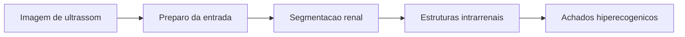

# Um Pipeline de Visao Computacional para Analise de Achados Hiperecogenicos em Ultrassonografia Renal

## Resumo

A interpretacao de ultrassonografias renais depende de inspecao visual subjetiva
e da delimitacao anatomica do rim. Este artigo propoe um pipeline de visao
computacional que primeiro segmenta o rim e depois analisa regioes
hiperecogenicas suspeitas proximas as piramides renais. Os modelos foram
retreinados com as imagens originais da base `kidneyUS` e aplicacao de `CLAHE`
no pre-processamento. Em um teste deduplicado de 70 imagens, a U-Net atingiu
Dice de `0,9290`, IoU de `0,8722` e precisao de `0,9236`, obtendo o maior Dice
entre as arquiteturas avaliadas. Aplicado a `4.479` imagens externas, esse
modelo gerou `3.534` pseudomascaras candidatas, ainda pendentes de revisao
humana e ausentes das metricas apresentadas. Na etapa intrarrenal, a U-Net
multiclasse alcancou Dice medio de `0,7594` em 50 imagens de teste anotadas
manualmente.

## Introducao

A ultrassonografia renal e acessivel, nao invasiva e amplamente utilizada na
avaliacao de alteracoes estruturais do rim. Na pratica clinica, regioes muito
claras no parenquima, especialmente proximas as piramides renais, podem indicar
achados suspeitos que exigem analise cuidadosa.

A ecogenicidade cortical, especialmente quando comparada ao figado, tambem e
observada em pacientes com doenca renal cronica. A razao entre a intensidade
cortical renal e a intensidade de um orgao de referencia pode reduzir parte da
subjetividade da inspecao visual.

Em paralelo, a literatura explora a segmentacao renal e a extracao de medidas
quantitativas de intensidade e textura para investigar padroes associados a
alteracoes renais. Ainda assim, permanece uma lacuna entre segmentar o rim e
examinar, dentro dele, pontos hiperecogenicos candidatos a achados suspeitos.

Esse recorte e importante porque a ultrassonografia apresenta ruido, sombras
acusticas, variacoes de ganho e diferencas de enquadramento. Sem uma mascara
renal confiavel, pontos muito claros podem ser confundidos com artefatos ou
estruturas externas ao rim. Por isso, este trabalho parte da delimitacao
semantica do rim e, somente depois, transforma achados hiperecogenicos em
medidas computacionais.

Nesse contexto, este artigo combina segmentacao renal, expansao supervisionada
por pseudomascaras e extracao de atributos intrarrenais. As imagens originais
da base `kidneyUS` foram usadas para retreinar, com `CLAHE`, quatro
arquiteturas de segmentacao da capsula renal, entre as quais a U-Net apresentou
o melhor Dice no teste deduplicado. A regiao renal delimitada alimenta uma
segunda U-Net, responsavel por identificar `Cortex`, `Medulla` e
`Central Echo Complex`.

As contribuicoes principais sao:

1. consolidacao do acervo com as imagens originais e suas anotacoes;
2. geracao rastreavel de pseudomascaras externas para revisao;
3. comparacao de segmentadores para delimitacao renal;
4. segmentacao das estruturas intrarrenais como suporte a analise exploratoria
   de achados hiperecogenicos.

## Contexto e Trabalhos Relacionados

A segmentacao automatica do rim em ultrassonografias constitui a primeira linha
relacionada a este estudo. Arquiteturas como U-Net, DeepLabV3 e SegFormer
empregam diferentes estrategias para preservar bordas, capturar contexto
multiescala e lidar com variacoes de textura. Neste trabalho, essas
arquiteturas sao comparadas na delimitacao da capsula renal, etapa que
restringe as analises posteriores ao interior do rim.

A segunda linha envolve a quantificacao da ecogenicidade renal relativa.
Medidas entre a intensidade do cortex renal e a de um orgao de referencia, como
o figado, podem aproximar criterios empregados por especialistas e reduzir
parte da subjetividade da inspecao visual.

A terceira linha compreende a extracao de atributos quantitativos de
intensidade e textura para investigar alteracoes renais. As piramides renais
estao localizadas na medula, entre o cortex e o sistema coletor, e constituem
referencias anatomicas internas na ultrassonografia.

Alem da delimitacao externa do rim, este trabalho identifica `Cortex`,
`Medulla` e `Central Echo Complex`. Essa representacao nao segmenta
individualmente cada piramide renal, mas fornece uma localizacao anatomica mais
especifica para restringir a busca por achados hiperecogenicos.

A qualidade das segmentacoes e avaliada pela comparacao entre a mascara
produzida pelo modelo e a anotacao manual. O coeficiente Dice mede a semelhanca
entre essas duas regioes, enquanto a `Intersection over Union` (`IoU`)
corresponde a razao entre a intersecao e a uniao das regioes. Ambas variam de
0 a 1: valores proximos de 1 indicam maior concordancia entre predicao e
referencia.

## Metodologia

A metodologia organiza o processamento em tres etapas encadeadas: localizacao
da capsula renal, verificacao da segmentacao pelo consenso entre modelos e
identificacao das estruturas intrarrenais. Essa organizacao delimita
progressivamente a regiao analisada e reduz a influencia de tecidos externos ao
rim. A Figura 1 apresenta o fluxo geral.



**Figura 1.** Pipeline metodologico: a capsula delimita o rim, cujas
estruturas internas orientam a analise de achados hiperecogenicos.

O estudo utiliza o `Open Kidney Ultrasound Data Set` (`kidneyUS`), que contem
anotacoes de dois observadores para capsula, cortex, medula e complexo
ecogenico central. A Tabela 1 resume os acervos utilizados e suas finalidades.

| Acervo | Registros | Imagens unicas | Finalidade |
| --- | ---: | ---: | --- |
| `kidneyUS` - capsula | 486 | 468 | 328 treino, 70 validacao e 70 teste |
| `kidneyUS` - regioes internas | 335 | 335 | 235 treino, 50 validacao e 50 teste |
| MONAI | 4.479 | 4.479 | 3.534 pseudomascaras para revisao |

**Tabela 1.** Acervos auditados e finalidade no estudo.

Para a capsula renal, foram usados 486 registros do primeiro anotador,
correspondentes a 468 imagens unicas. Apos deduplicacao e agrupamento por
exame, obtiveram-se 328 imagens de treino, 70 de validacao e 70 de teste. Para
a tarefa intrarrenal, 335 imagens foram divididas por paciente em 235, 50 e 50
imagens. O MONAI foi utilizado apenas para geracao de pseudomascaras, sem
participacao nas metricas manuais.

Na primeira etapa, U-Net, UNet++, DeepLabV3-ResNet50 e SegFormer-B0 foram
treinados para segmentar a capsula, com `CLAHE`, aumento de dados apenas no
treino, `AdamW`, taxa inicial de `10^-4` e perda `BCE + Dice`. A U-Net,
selecionada pelo maior Dice, foi aplicada ao MONAI. A inferencia combinou a
imagem original e seu espelhamento horizontal. Apos binarizacao pelo limiar
`0,35`, manteve-se o maior componente conectado e a mascara foi restaurada a
resolucao original.

As pseudomascaras foram ordenadas pela confianca media dos pixels positivos,
definida por:

```text
C = (1 / |M|) * soma(p_i), para i em M
```

em que `M` e a pseudomascara e `p_i` e a probabilidade prevista para o pixel
`i`. Esse valor auxilia a priorizacao da revisao, mas nao valida
automaticamente a mascara.

Para controlar as pseudomascaras externas, as mesmas imagens tambem foram
processadas pela DeepLabV3-ResNet50. A concordancia entre modelos foi estimada
pelo Dice entre a mascara da U-Net e a mascara da DeepLabV3:

```text
S(M_U, M_D) = 2 * |M_U intersecao M_D| / (|M_U| + |M_D|)
```

Esse escore foi usado como medida complementar de consenso entre arquiteturas e
como criterio operacional para priorizar a revisao humana das pseudomascaras.

Para a segmentacao intrarrenal, U-Net e DeepLabV3-ResNet50 foram retreinadas na
mesma divisao de 235 imagens de treino, 50 de validacao e 50 de teste. Ambas
recebem tres canais: ROI em tons de cinza, ROI com a regiao externa zerada e
mascara da capsula. A saida multiclasse prediz `Cortex`, `Medulla` e
`Central Echo Complex`, com `CLAHE`, `AdamW`, taxa de `10^-4` e perda
entropia cruzada + Dice.

## Resultados

A primeira etapa avaliou a segmentacao da capsula renal. Nas 70 imagens do
teste deduplicado, a U-Net apresentou os melhores valores de Dice, IoU,
precisao e recall, sendo selecionada para localizar o rim na cascata. O
SegFormer-B0, embora ligeiramente inferior nas metricas de sobreposicao,
obteve a maior velocidade media de inferencia.

| Modelo | Dice | IoU | Precisao | Recall | FPS medio |
| --- | ---: | ---: | ---: | ---: | ---: |
| U-Net | **0,9290** | **0,8722** | **0,9236** | **0,9440** | 18,11 |
| SegFormer-B0 | 0,9223 | 0,8598 | 0,9117 | 0,9426 | **31,34** |
| DeepLabV3 R50 | 0,9203 | 0,8606 | 0,9219 | 0,9338 | 22,26 |
| UNet++ | 0,9099 | 0,8419 | 0,8910 | 0,9419 | 16,57 |

**Tabela 2.** Segmentacao da capsula no teste deduplicado.

O controle por consenso foi calibrado nas 468 imagens manuais por validacao
cruzada em cinco folds. O consenso medio foi `0,9416`, com mediana de
`0,9627`, e apresentou correlacao de `0,840` com o menor Dice frente a
anotacao manual. Nas `4.479` imagens externas, a U-Net gerou `3.534`
pseudomascaras, enquanto o consenso entre modelos foi usado como indicador
operacional de qualidade e priorizacao, nao como substituto da validacao
manual.


**Figura 2.** Consenso entre U-Net e DeepLabV3: exemplos de concordancia alta,
intermediaria e baixa entre os contornos previstos.

Por fim, U-Net e DeepLabV3 foram comparadas na segmentacao intrarrenal usando
as mesmas 50 imagens de teste com referencia manual. A U-Net obteve os maiores
valores de Dice para cortex e medula, enquanto a DeepLabV3 foi ligeiramente
superior no complexo ecogenico central. Na media das tres classes, a U-Net
apresentou o melhor resultado agregado.

| Modelo | Cortex | Medula | CEC | Dice medio | IoU medio |
| --- | ---: | ---: | ---: | ---: | ---: |
| U-Net | **0,7075** | **0,7237** | 0,8469 | **0,7594** | **0,6163** |
| DeepLabV3 R50 | 0,6822 | 0,7156 | **0,8497** | 0,7492 | 0,6045 |

**Tabela 3.** Comparacao intrarrenal no teste manual de 50 imagens.

Embora a diferenca media seja pequena, a U-Net foi mantida como modelo
intrarrenal da cascata por apresentar o melhor resultado agregado e maior Dice
em duas das tres estruturas.


**Figura 3.** Exemplo da etapa intrarrenal: imagem original, anotacao manual e
predicao multiclasse da U-Net para cortex, medula e complexo ecogenico
central.


**Figura 4.** Contraste qualitativo no conjunto externo: exemplo sem predicao
e exemplo com limites renais mais nitidos, acompanhado dos contornos previstos
pela U-Net e pela DeepLabV3.

## Discussao

A qualidade das imagens foi um dos fatores mais associados as falhas de
segmentacao da capsula. Baixo contraste, sombras acusticas, ruido e perda de
detalhes dificultam a identificacao dos limites renais e reduzem a estabilidade
da segmentacao no conjunto externo.

A cascata tambem permanece dependente da primeira etapa: uma mascara renal
incompleta, deslocada ou com tecido adjacente altera a ROI e pode comprometer a
identificacao das estruturas internas. Por isso, o consenso entre modelos foi
tratado como mecanismo de triagem e priorizacao de revisao, e nao como
substituto da validacao humana.

As pseudomascaras externas representam uma estrategia de engenharia de dados,
nao um resultado clinico final. O repositorio documenta essa etapa de forma
rastreavel, mas a confirmacao da qualidade das mascaras ainda depende de
curadoria especializada.

## Conclusao

Este trabalho apresentou um pipeline rastreavel para analise de
ultrassonografias renais em tres etapas: segmentacao da capsula, verificacao
por consenso entre modelos e segmentacao das estruturas intrarrenais.

Na delimitacao da capsula, a U-Net obteve Dice de `0,9290` e IoU de `0,8722`
no teste deduplicado de 70 imagens. O consenso com a DeepLabV3 ajudou a
priorizar a revisao das `3.534` pseudomascaras externas sem substituir a
validacao por especialistas. Na etapa intrarrenal, a U-Net alcancou Dice medio
de `0,7594` nas 50 imagens de teste.

Como proximo passo cientifico, a evolucao natural do trabalho e incorporar
apenas pseudomascaras revisadas e estabelecer referencia clinica ou histologica
para investigar a associacao entre regioes hiperecogenicas e alteracoes
funcionais do rim.

## Referencias

- CHAVHAN, Govind B.; PARRA, Dimitri A.; OUDJHANE, Kamaldine et al. *Renal
  pyramid echogenicity in ureteropelvic junction obstruction: correlation
  between altered echogenicity and differential renal function*. Pediatric
  Radiology, v. 38, n. 10, p. 1063-1069, 2008.
- CHEN, Liang-Chieh; ZHU, Yukun; PAPANDREOU, George; SCHROFF, Florian; ADAM,
  Hartwig. *Encoder-Decoder with Atrous Separable Convolution for Semantic
  Image Segmentation*. European Conference on Computer Vision (ECCV), p.
  801-818, 2018.
- CONSTANTINO, Kattiana; CRUZ, Victor Augusto L.; ZUCHERATTO, Otavio M. M. et
  al. *Segmentacao e Classificacao Semantica de Trechos de Diarios Oficiais
  Usando Aprendizado Ativo*. Anais do XXXVII Simposio Brasileiro de Banco de
  Dados (SBBD), p. 304-316, 2022.
- DICE, Lee R. *Measures of the Amount of Ecologic Association Between
  Species*. Ecology, v. 26, n. 3, p. 297-302, 1945.
- JACCARD, Paul. *Etude comparative de la distribution florale dans une
  portion des Alpes et des Jura*. Bulletin de la Societe Vaudoise des Sciences
  Naturelles, v. 37, p. 547-579, 1901.
- LEE, Dong-Hyun. *Pseudo-Label: The Simple and Efficient Semi-Supervised
  Learning Method for Deep Neural Networks*. Workshop on Challenges in
  Representation Learning, ICML, 2013.
- LIMA, Daniel M.; MORENO, Ramon A.; PIRES, Fabio A.; GUTIERREZ, Marco A. *Uma
  proposta de data lake para pesquisa em saude a partir de data pools
  multicentricos interoperaveis*. Anais do XXXVI Simposio Brasileiro de Banco
  de Dados (SBBD), p. 367-372, 2021.
- MANLEY, J. A.; O'NEILL, W. C. *How echogenic is echogenic? Quantitative
  acoustics of the renal cortex*. American Journal of Kidney Diseases, v. 37,
  n. 4, p. 706-711, 2001.
- RONNEBERGER, Olaf; FISCHER, Philipp; BROX, Thomas. *U-Net: Convolutional
  Networks for Biomedical Image Segmentation*. Medical Image Computing and
  Computer-Assisted Intervention (MICCAI), p. 234-241, 2015.
- SINGLA, Rohit; RINGSTROM, Cailin; HU, Grace; LESSOWAY, Victoria; REID,
  Janice; NGUAN, Christopher; ROHLING, Robert. *The Open Kidney Ultrasound Data
  Set*. In: *Simplifying Medical Ultrasound*. Lecture Notes in Computer
  Science, v. 14337, p. 155-164, 2023.
- XIE, Enze; WANG, Wenhai; YU, Zhiding; ANANDKUMAR, Anima; ALVAREZ, Jose M.;
  LUO, Ping. *SegFormer: Simple and Efficient Design for Semantic Segmentation
  with Transformers*. Advances in Neural Information Processing Systems, v. 34,
  p. 12077-12090, 2021.
- ZUIDERVELD, Karel. *Contrast Limited Adaptive Histogram Equalization*. In:
  HECKBERT, Paul S. (ed.). *Graphics Gems IV*. Academic Press, p. 474-485,
  1994.
