# Wiki — Kidney

> Estado documentado a partir da branch `main` em 03/10/2026. O projeto é experimental e de pesquisa; as saídas não constituem diagnóstico clínico.

## O que é o projeto

O **Kidney** é um projeto de visão computacional aplicado à ultrassonografia renal. Seu objetivo atual não é apenas segmentar o rim, mas construir uma cadeia rastreável que permita:

1. organizar diferentes fontes de imagens renais;
2. segmentar a cápsula renal;
3. delimitar as principais estruturas intrarrenais;
4. revisar e corrigir as predições com participação humana;
5. extrair medidas quantitativas de ecogenicidade;
6. preparar uma base confiável para análises científicas posteriores.

O projeto evoluiu de experimentos isolados de segmentação para uma arquitetura em cascata, na qual cada etapa fornece contexto anatômico para a seguinte.

```mermaid
flowchart LR
    A[Fontes de dados] --> B[Engenharia de dataset]
    B --> C[Segmentação da cápsula]
    C --> D[Consenso entre modelos]
    D --> E[Curadoria humana]
    E --> F[Segmentação intrarrenal]
    F --> G[Ecogenicidade / atributos]
    G --> H[Análise exploratória]
    H --> I[Artigo / dissertação]
```

## Como ler esta wiki

A wiki foi organizada para responder perguntas diferentes sobre o projeto.

| Página | Pergunta que ela responde |
|---|---|
| [Arquitetura do pipeline](arquitetura.md) | Como todas as partes do sistema se conectam? |
| [Dados e curadoria](dados-e-curadoria.md) | De onde vêm as imagens e como uma máscara passa a ser considerada confiável? |
| [Modelos e resultados](modelos-e-resultados.md) | Quais modelos foram comparados e quais resultados já foram obtidos? |
| [Ecogenicidade](ecogenicidade.md) | Como o projeto transforma as máscaras anatômicas em medidas quantitativas? |
| [Execução e reprodutibilidade](execucao-e-reprodutibilidade.md) | Como reproduzir os principais fluxos e experimentos? |
| [Histórico metodológico](historico-metodologico.md) | Quais decisões mudaram ao longo do desenvolvimento? |
| [Roadmap e limitações](roadmap-e-limitacoes.md) | O que ainda falta validar, melhorar ou implementar? |
| [Documentação técnica](documentacao-tecnica.md) | Quais documentos detalhados existem em `docs/` e como eles se relacionam? |

## Eixos científicos do projeto

### 1. Segmentação da cápsula renal

A primeira tarefa é localizar o rim de maneira confiável. Essa máscara define a região de interesse para todas as etapas seguintes.

### 2. Segmentação intrarrenal

Depois de localizar o rim, o projeto tenta separar:

- `Cortex`;
- `Medulla`;
- `Central Echo Complex (CEC)`.

Essa organização anatômica permite estudar padrões internos sem misturar tecidos externos ao órgão.

### 3. Curadoria human-in-the-loop

As predições automáticas são tratadas como propostas. Especialistas ou revisores podem aceitar, corrigir ou rejeitar cada camada.

### 4. Ecogenicidade quantitativa

Com máscaras anatômicas disponíveis, o sistema mede relações de brilho entre estruturas, especialmente entre córtex e CEC.

### 5. Engenharia de dataset

O projeto mantém a proveniência das imagens, separa dados manuais de pseudo-rótulos e preserva manifestos e relatórios de auditoria.

## Estado científico resumido

### Segmentação da cápsula

A U-Net obteve no teste deduplicado de 70 imagens do kidneyUS:

- Dice: **0,9290**
- IoU: **0,8722**
- Precisão: **0,9236**
- Recall: **0,9440**

### Segmentação intrarrenal

A U-Net multiclasse obteve Dice médio de **0,7594** no teste manual de 50 imagens.

### Expansão externa

No recorte consolidado utilizado no artigo:

- 4.479 imagens externas MONAI;
- 3.534 pseudo-máscaras renais candidatas geradas pela U-Net;
- todas permanecem conceitualmente separadas da referência manual.

### Consenso entre modelos

U-Net e DeepLabV3 são usadas em conjunto para estimar estabilidade da predição. O consenso ajuda a ordenar a fila de revisão, mas não equivale a validação humana.

### Ecogenicidade

A análise quantitativa trabalha com a imagem original, sem CLAHE, e utiliza comparação local entre córtex e CEC.

## Regra metodológica mais importante

> Uma pseudo-máscara não se torna `ground truth` apenas porque o modelo apresentou alta confiança ou porque dois modelos concordaram.

Confiança, morfologia e consenso são usados para priorização. A entrada em uma base curada exige revisão humana quando o dado será tratado como referência confiável.

## Componentes do repositório

| Caminho | Papel |
|---|---|
| `src/segmentation/` | Segmentação, avaliação, consenso e experimentos |
| `engenharia_dataset/` | Construção, conversão, expansão e divisão de datasets |
| `curadoria_web/` | Aplicação de revisão, correção, inferência e ecogenicidade |
| `models/` | Checkpoints e metadados |
| `results/` | Resultados experimentais e auditorias |
| `docs/` | Documentação técnica e decisões metodológicas |
| `docs/wiki/` | Visão consolidada e navegável do projeto |
| `artigo/SBBD_2026___Jefferson/` | Versão ativa do artigo |
| `config/` | Fontes externas e configurações |
| `run_pipeline.py` | Runner simplificado do eixo de atributos/classificação |

## Relação entre wiki e documentação técnica

A wiki é uma camada de orientação. Ela explica o papel de cada componente e conecta os documentos detalhados, sem substituí-los.

Todos os documentos Markdown de `docs/` foram catalogados em [Documentação técnica](documentacao-tecnica.md), com descrição, agrupamento temático e links diretos.

## Para quem chega agora

A leitura recomendada é:

1. esta página;
2. [Arquitetura do pipeline](arquitetura.md);
3. [Dados e curadoria](dados-e-curadoria.md);
4. [Modelos e resultados](modelos-e-resultados.md);
5. [Ecogenicidade](ecogenicidade.md);
6. [Histórico metodológico](historico-metodologico.md);
7. [Roadmap e limitações](roadmap-e-limitacoes.md);
8. [Documentação técnica](documentacao-tecnica.md).

Assim é possível entender primeiro o desenho geral, depois os experimentos e, por fim, as decisões científicas que ainda estão em aberto.
