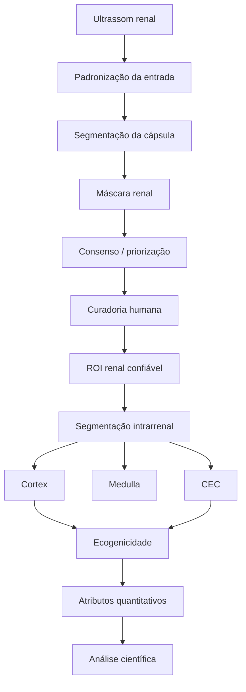

# Arquitetura do pipeline

[← Wiki](README.md)

## Objetivo desta página

Esta página descreve **como os componentes técnicos se conectam**. Ela não é um inventário de todos os scripts, mas o mapa lógico do sistema: qual etapa recebe qual entrada, produz qual saída e de que forma um erro pode afetar as etapas seguintes.

## Visão geral

O projeto segue uma arquitetura em cascata.



A lógica central é simples: **não analisar estruturas internas antes de localizar o rim**.

## Camada 1 — entrada e preparação

As imagens podem vir da base kidneyUS, de fontes externas como MONAI ou de uma nova imagem enviada à interface de inferência.

Para tarefas de segmentação, o pipeline pode aplicar operações como:

- conversão para escala de cinza;
- redimensionamento;
- normalização;
- CLAHE;
- aumento de dados no treino.

Essas transformações servem ao modelo de segmentação. Elas não devem ser confundidas com a imagem usada para medir ecogenicidade.

## Camada 2 — segmentação da cápsula

A cápsula renal define o contorno externo do rim.

Essa etapa é crítica porque:

- remove grande parte do fundo;
- restringe a análise a uma ROI anatômica;
- reduz falsos achados externos;
- fornece contexto para a rede intrarrenal.

A implementação está concentrada em:

```text
src/segmentation/
```

A U-Net é atualmente o modelo de referência da cascata de cápsula no fluxo consolidado do artigo.

## Camada 3 — pós-processamento

Após a predição, a máscara pode passar por operações como:

- aplicação de limiar;
- remoção de componentes pequenos;
- preservação do maior componente conectado;
- restauração para a resolução original.

Essas etapas devem ser registradas porque alteram a máscara final entregue às etapas seguintes.

## Camada 4 — consenso entre modelos

A mesma imagem pode ser processada por U-Net e DeepLabV3.

O Dice entre as duas máscaras produz um indicador de concordância:

```text
predição U-Net
        +
predição DeepLabV3
        ↓
Dice entre modelos
        ↓
prioridade de revisão
```

O consenso não substitui uma anotação manual. Ele funciona como mecanismo de triagem.

## Camada 5 — curadoria humana

A Curadoria Web transforma o fluxo automático em human-in-the-loop.

O revisor pode:

- visualizar a imagem original;
- ativar/desativar camadas;
- ampliar regiões;
- aceitar uma máscara;
- corrigir uma máscara;
- rejeitar uma máscara;
- marcar a estrutura como indisponível;
- adicionar marcador de anomalia;
- ajustar as ROIs usadas na ecogenicidade.

A proposta original permanece separada da correção manual.

## Camada 6 — segmentação intrarrenal

Com a ROI renal definida, o segundo estágio tenta separar:

```text
Rim
├── Cortex
├── Medulla
└── Central Echo Complex
```

A versão multiclasse permite obter essas estruturas em uma única inferência.

Essa etapa utiliza informação da própria cápsula como contexto, o que torna a cascata dependente da qualidade da primeira segmentação.

## Camada 7 — ecogenicidade

A análise de brilho recebe:

- imagem original;
- máscara de córtex;
- máscara de CEC;
- opcionalmente máscara de medula.

A imagem usada nessa etapa é a original, sem CLAHE.

O objetivo não é classificar automaticamente uma doença, mas criar descritores mensuráveis da diferença de brilho entre regiões anatômicas.

## Camada 8 — atributos e classificação exploratória

O repositório também contém um eixo baseado em extração de atributos e classificação, acessível pelo `run_pipeline.py`.

Esse eixo deve ser entendido como complementar à segmentação, não como substituto da cascata anatômica.

## Dependências entre etapas

| Falha | Efeito provável |
|---|---|
| Rim não localizado | Todo o fluxo seguinte perde validade |
| Máscara renal incompleta | Estruturas internas podem ser truncadas |
| Máscara renal com tecido externo | Segmentação intrarrenal pode incluir regiões indevidas |
| Cortex incorreto | Razões de ecogenicidade ficam enviesadas |
| CEC incorreto | Referência interna de brilho fica comprometida |
| Imagem com ganho muito diferente | Comparações de intensidade podem mudar |

## Componentes técnicos

| Componente | Local |
|---|---|
| Segmentação | `src/segmentation/` |
| Engenharia de dataset | `engenharia_dataset/` |
| Interface de curadoria | `curadoria_web/` |
| Inferência local | `curadoria_web/inference.py` |
| Modelos | `models/` |
| Resultados | `results/` |
| Artigo | `artigo/SBBD_2026___Jefferson/` |

## Princípio de desenho

A arquitetura segue três separações importantes:

### Automação ≠ validação

O modelo gera uma proposta. A aceitação depende do protocolo de curadoria.

### Segmentação ≠ interpretação clínica

Uma boa máscara anatômica não prova doença.

### Pré-processamento de modelo ≠ imagem quantitativa

CLAHE pode ajudar o modelo, mas não deve alterar a imagem usada para medir brilho.

## Próxima leitura

Depois de entender a arquitetura, siga para [Dados e curadoria](dados-e-curadoria.md) para ver como as imagens e máscaras percorrem esse fluxo.
