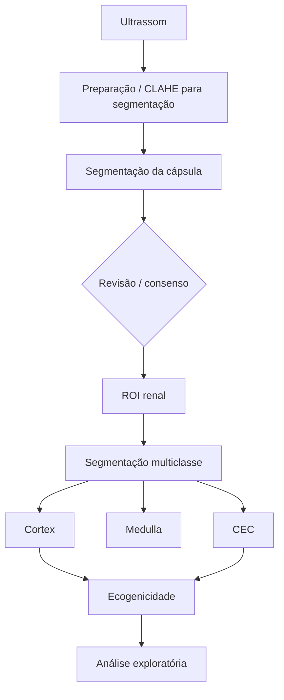

# Arquitetura do pipeline

[← Wiki](README.md)

## Fluxo principal

O pipeline é uma cascata anatômica: primeiro delimita o rim, depois trabalha dentro da região renal.

## Engenharia de dados

Os scripts em `engenharia_dataset/` cuidam de obtenção e conversão de fontes externas, deduplicação, manifestos, splits, miniaturas, pseudo-máscaras e extração de atributos. A regra do projeto é manter proveniência e separar dado manual, automático e revisado.

## Segmentação da cápsula

A implementação atual está em `src/segmentation/`. O fluxo principal usa uma U-Net treinada no kidneyUS. CLAHE é usado no pré-processamento da segmentação; medidas quantitativas de brilho usam a imagem original.

## Consenso entre modelos

U-Net e DeepLabV3 fornecem visões independentes da máscara renal. O Dice entre predições funciona como indicador de estabilidade. Consenso alto não equivale a anotação humana.

## Segmentação intrarrenal

A ROI renal alimenta uma rede multiclasse que produz `Cortex`, `Medulla` e `Central Echo Complex`. Essa etapa depende diretamente da qualidade da cápsula.

## Curadoria Web

`curadoria_web/` fornece visualização das camadas, zoom, aceitar/corrigir/rejeitar, edição por polígono, histórico das correções, exportação CSV/JSON, inferência local e painel de ecogenicidade.

## Análise quantitativa

A ecogenicidade é calculada na imagem B-mode original. O eixo principal atual compara córtex e CEC em ROIs pareadas de profundidade aproximada.

## Separação entre treino e avaliação

A avaliação final deve permanecer baseada em referência humana congelada. Dados pseudo-rotulados podem aparecer em experimentos de expansão, mas devem ser reportados separadamente.
