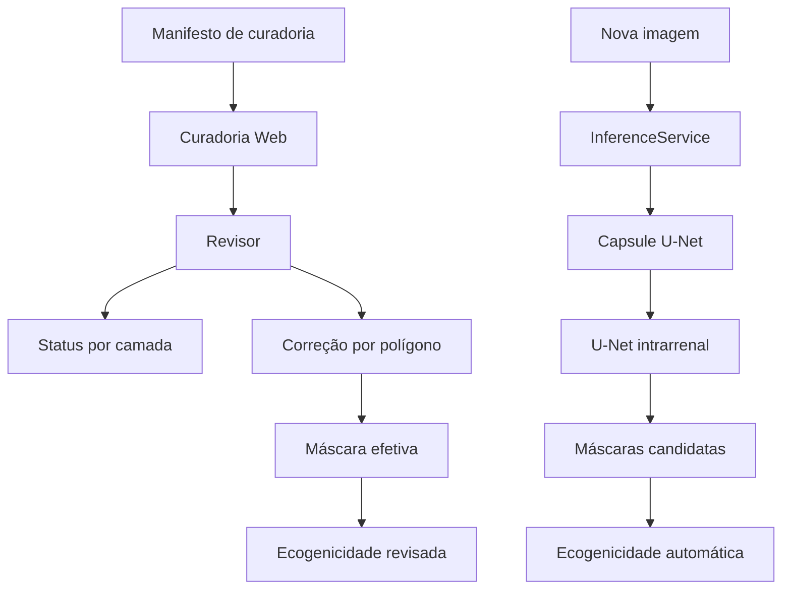

# Curadoria Web e inferência

[← Wiki](README.md)

## Visão geral

A pasta `curadoria_web/` transforma o pipeline de segmentação em uma aplicação de revisão human-in-the-loop.

Ela tem dois componentes principais:

- `app.py`: servidor HTTP, persistência, revisão, correções, exportação e cálculo de ecogenicidade;
- `inference.py`: serviço local de inferência para novas imagens.

---

# `curadoria_web/app.py`

## Função geral

É o servidor principal da interface de curadoria.

Ele:
1. carrega o manifesto visual;
2. mantém o banco SQLite;
3. lista casos;
4. entrega imagens/máscaras;
5. salva decisões de revisão;
6. cria correções por polígono;
7. mantém histórico;
8. calcula medidas de brilho;
9. exporta dados;
10. integra a inferência de novas imagens.

---

## `MaskCorrectionService`

Gerencia as correções de máscara feitas pelo revisor.

### `create_from_polygon(payload)`

Recebe:
- imagem;
- revisor;
- camada;
- operação;
- coordenadas do polígono.

### Camadas suportadas
- rim;
- cortex;
- medulla;
- central_echo_complex;
- anomalia.

### Operações

A máscara pode ser:
- substituída;
- adicionada;
- apagada.

O script rasteriza o polígono e salva uma nova máscara PNG.

### Histórico

Além da versão atual, cada salvamento cria uma cópia imutável em:

```text
mascaras_corrigidas/<revisor>/historico/<camada>/<image_id>/
```

Isso preserva auditoria temporal.

---

### `read(...)`

Recupera correções armazenadas, filtrando por imagem, revisor e camada.

---

### `update_approval(...)`

Atualiza o status de aprovação de uma correção e registra quem aprovou.

---

### `delete(...)`

Remove a correção atual de uma camada/revisor quando solicitado.

---

# `CurationStore`

É a camada de dados da aplicação.

## Inicialização

Recebe:
- caminho do manifesto;
- banco SQLite;
- diretório de cache.

No início:
1. carrega manifestos;
2. cria índices;
3. prepara o banco;
4. adapta estruturas antigas quando necessário.

---

## `_load_manifest()`

Lê o manifesto visual e valida as colunas necessárias.

Também resolve caminhos vindos do Windows quando a aplicação está rodando em container/Linux.

Isso permite que manifestos gerados em `D:\kidney\...` ainda sejam resolvidos quando o projeto está montado em `/data`.

---

## Banco SQLite

O método `_prepare_database()` cria ou atualiza tabelas usadas para:

- revisões;
- correções;
- histórico das correções;
- exportação;
- seleção manual das ROIs de brilho.

Também migra marcações antigas chamadas `fibrose` para a camada mais neutra `anomalia`.

---

## `summary(reviewer)`

Produz contagens usadas pela interface, por exemplo:
- total;
- revisados;
- pendentes;
- distribuição por status.

---

## `list_items(...)`

Lista casos para a tela principal.

### Filtros
- revisor;
- estado;
- fonte;
- tipo de anotação;
- busca textual;
- limite.

Itens cujo arquivo de imagem não pode ser resolvido são ignorados.

---

## `get_item(image_id, reviewer, model)`

Monta o objeto completo de um caso.

Ele reúne:
- imagem;
- origem;
- dimensões;
- máscara efetiva do rim;
- córtex;
- medula;
- CEC;
- correções do revisor;
- métricas do modelo;
- medidor de brilho;
- URLs das camadas.

### Máscara efetiva

Quando existe correção manual do revisor, ela prevalece sobre a proposta automática.

Essa regra é central para o human-in-the-loop.

---

## `save_review(payload)`

Salva o estado de cada camada.

### Status válidos
- pendente;
- aceita;
- corrigir;
- rejeitada;
- indisponivel.

O registro fica associado ao revisor.

A atualização preserva o horário original de criação e altera apenas o timestamp de atualização.

---

## `effective_mask(...)`

Resolve qual máscara deve ser usada naquele momento.

A prioridade é conceitualmente:

```text
correção manual do revisor
→ máscara do modelo selecionado
→ máscara original do manifesto
```

Isso garante que a análise visual e de ecogenicidade respeite a versão revisada.

---

# Ecogenicidade em `app.py`

## `brightness_meter(...)`

Calcula medidas de brilho usando a imagem original.

### Regiões principais
- Cortex;
- CEC;
- opcionalmente Medulla.

### Estatísticas de região
O código calcula medidas como:
- média;
- mediana;
- percentis;
- IQR;
- saturação;
- número de pixels.

---

## ROIs pareadas

A função interna `paired_rois(...)` procura pares de regiões circulares entre Cortex e CEC.

### Fluxo
1. identifica máscaras válidas;
2. exclui bordas;
3. busca discos internos;
4. tenta manter profundidade vertical semelhante;
5. forma pares;
6. mede cada par.

O revisor pode substituir a seleção automática por coordenadas armazenadas no banco.

---

## `save_brightness_rois(payload)`

Persiste as ROIs ajustadas manualmente.

A chave inclui:
- image_id;
- reviewer;
- modelo.

Assim, diferentes revisores podem manter seleções independentes.

---

# Exportação

## `export_rows()`

Transforma revisões, correções e ROIs em linhas exportáveis.

Inclui:
- status;
- observação;
- paths das máscaras corrigidas;
- operação;
- timestamps;
- ROIs de brilho ajustadas.

---

## `export_to_database(reviewer)`

Copia as linhas consolidadas para a tabela de exportação interna do SQLite.

---

# Mídia

## `contour_bytes(...)`

Gera uma imagem de contorno da máscara escolhida, usada pela interface para sobreposição.

## `transformed_image_bytes(...)`

Entrega versões da imagem solicitadas pela UI, mantendo separada a imagem original usada nos cálculos.

---

# API HTTP

A classe `CurationHandler` implementa o servidor.

## GET

### `/api/meta`
Informações gerais da aplicação.

### `/api/items`
Lista filtrada de casos.

### `/api/item/<image_id>`
Detalhes completos de uma imagem.

### `/api/inferences/<...>`
Recupera arquivos gerados pelo serviço de inferência.

### `/api/corrections`
Consulta correções.

### `/api/corrections/<image_id>`
Consulta correções de um caso.

### `/api/media/<image_id>/<kind>`
Entrega imagem ou camada visual.

### `/api/export.json`
Exporta registros em JSON.

### `/api/export.csv`
Exporta registros em CSV.

---

## POST

### `/api/reviews`
Salva a revisão de uma imagem.

### `/api/corrections`
Cria correção por polígono.

### `/api/database-export`
Materializa exportação no SQLite.

### `/api/inferences`
Recebe uma nova imagem e executa a cascata de inferência.

### `/api/brightness-rois`
Salva o ajuste manual das ROIs de ecogenicidade.

---

## PUT

A rota de correções permite atualizar o status/aprovação de uma correção existente.

---

# `curadoria_web/inference.py`

## `InferenceService`

Executa a cascata em uma imagem enviada pelo usuário.

### Inicialização

Recebe:
- raiz do projeto;
- diretório de saída;
- função de cálculo de brilho.

---

## `_load_models()`

Carrega os checkpoints necessários para:
1. segmentação da cápsula;
2. segmentação intrarrenal.

Os pesos são carregados apenas no ambiente local que possui PyTorch e os arquivos em `models/`.

---

## `infer(data_url, filename)`

É o fluxo principal.

### Entrada
Imagem enviada em formato Data URL.

### Processamento
1. decodifica a imagem;
2. converte para formato utilizável;
3. executa U-Net de cápsula;
4. obtém máscara renal;
5. calcula bounding box da ROI;
6. executa U-Net multiclasse intrarrenal;
7. reconstrói Cortex, Medulla e CEC no tamanho original;
8. salva as máscaras;
9. calcula ecogenicidade;
10. devolve URLs e metadados.

### Saída conceitual

```text
imagem enviada
├── rim
├── cortex
├── medulla
├── CEC
└── medidas de ecogenicidade
```

---

## Persistência da inferência

Os resultados ficam em:

```text
dataset_aumentado/curadoria/respostas/inferencias/
```

Essas inferências:
- não entram automaticamente na fila de curadoria;
- não viram treino;
- não constituem diagnóstico.

---

## `media(image_id, kind)`

Resolve e entrega os arquivos gerados durante a inferência.

---

# Relação entre revisão e inferência



## Princípio de segurança metodológica

A interface foi desenhada para separar explicitamente:
- proposta automática;
- correção humana;
- medida quantitativa;
- interpretação clínica.

Essa separação é parte da metodologia do projeto, não apenas da interface.
