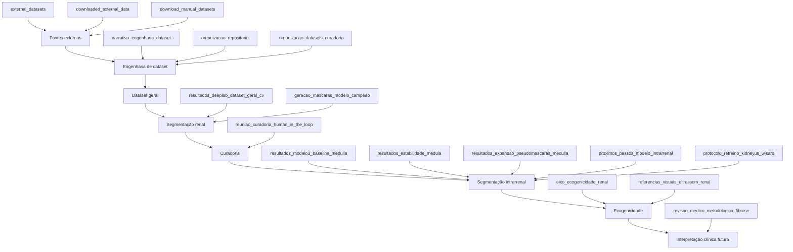

# Documentação técnica do projeto

[← Wiki](README.md)

## Objetivo desta página

Esta página transforma os arquivos Markdown existentes em `docs/` em um índice navegável. Os documentos foram agrupados por tema para que a wiki funcione como porta de entrada para todo o histórico técnico do projeto.

> Alguns documentos descrevem fases anteriores do pipeline. Quando houver diferença entre um documento histórico e a regra atual, prevalece a interpretação consolidada na wiki e no [Histórico metodológico](historico-metodologico.md).

## 1. Engenharia de dados e fontes externas

### [Narrativa da engenharia de dataset](../narrativa_engenharia_dataset.md)

Explica por que o projeto ampliou a base original, como fontes externas foram pesquisadas e como o MONAI/NVIDIA foi incorporado de forma incremental. Também descreve o papel do `dataset_geral`, a proveniência das imagens e a separação entre máscara manual, pseudo-máscara e imagem ainda sem referência.

### [Datasets externos candidatos](../external_datasets.md)

Inventário de bases externas de ultrassom renal ou abdominal avaliadas para expansão, pré-treinamento, robustez e tarefas auxiliares. Inclui kidneyUS, MONAI, Kaggle, TRUSTED, Mississippi State, CGPxy e outras fontes, com observações sobre modalidade, rótulos, licença e uso recomendado.

### [Dados externos já baixados ou inspecionados](../downloaded_external_data.md)

Registro operacional das fontes que chegaram a ser baixadas, indexadas ou processadas localmente. Documenta especialmente o processamento do MONAI/NVIDIA, o volume de estudos candidatos, conversão DICOM→PNG e critérios de descarte.

### [Como baixar os demais datasets](../download_manual_datasets.md)

Guia de aquisição manual e automática das bases externas. Define onde armazenar dados brutos e processados, como usar Kaggle e como integrar uma nova fonte ao mesmo fluxo de engenharia de dados.

## 2. Organização do repositório e dos datasets

### [Organização do repositório](../organizacao_repositorio.md)

Define a estrutura oficial das pastas, o papel de cada diretório, o que é fonte, derivado, histórico ou temporário e quais artefatos não devem ser removidos sem registro.

### [Organização dos datasets e da curadoria](../organizacao_datasets_curadoria.md)

Detalha a estrutura de `dataset_aumentado/`, incluindo bases supervisionadas, intermediárias, pseudo-expandidas e artefatos de curadoria. É a referência para entender onde cada tipo de dado deve ficar.

## 3. Segmentação renal e expansão da cápsula

### [Resultados DeepLabV3 no dataset_geral](../resultados_deeplab_dataset_geral_cv.md)

Relatório da validação cruzada do DeepLabV3-ResNet50 no `dataset_geral_cv`. Registra protocolo, métricas por fold, melhor checkpoint e o resultado consolidado de Dice/IoU.

**Leitura importante:** esse experimento usa uma base expandida e não deve ser comparado diretamente ao benchmark manual deduplicado do kidneyUS.

### [Geração de máscaras faltantes com o modelo campeão](../geracao_mascaras_modelo_campeao.md)

Descreve a etapa histórica em que o melhor DeepLabV3 do `dataset_geral` foi aplicado às imagens sem máscara, com filtros automáticos de qualidade.

Hoje essas máscaras devem ser interpretadas como pseudo-máscaras candidatas, não como ground truth automaticamente validado.

## 4. Segmentação intrarrenal e medula

### [Pipeline rim–medula–marcadores](../pipeline_rim_medula_opacidade.md)

Documento de transição metodológica que organiza o fluxo:

```text
imagem → rim → ROI renal → medula → medidas ultrassonográficas
```

Também separa a segmentação anatômica demonstrável de hipóteses futuras sobre fibrose.

### [Próximos passos do modelo intrarrenal](../proximos_passos_modelo_intrarrenal.md)

Descreve a evolução do chamado “modelo 3”: segmentação de córtex/medula, marcadores de ecogenicidade e eventual predição clínica apenas quando existirem rótulos apropriados.

### [Baseline supervisionado de Medulla](../resultados_modelo3_baseline_medulla.md)

Registra a primeira referência quantitativa para a classe `Medulla`, incluindo concordância entre anotadores, baseline heurístico, DeepLabV3 e MedullaROIUNet.

### [Estabilidade da segmentação de Medulla](../resultados_estabilidade_medula.md)

Avalia o que acontece quando a ROI renal manual é substituída pela ROI prevista pelo modelo. Também mede estabilidade da intensidade/opacidade e usa consenso entre modelos para priorizar pseudo-máscaras.

### [Expansão controlada de pseudo-máscaras de Medulla](../resultados_expansao_pseudomascaras_medulla.md)

Documenta os experimentos de expansão do treino com pseudo-rótulos de medula, mantendo validação/teste manuais e registrando o efeito da expansão nas métricas.

## 5. Novo ciclo kidneyUS e WiSARD

### [Protocolo revisado: kidneyUS como fonte única e WiSARD](../protocolo_retreino_kidneyus_wisard.md)

Formaliza a decisão de usar o kidneyUS como fonte canônica, retirar o `flood_1` como base independente e explorar WiSARD/WNN apenas dentro da ROI renal, como baseline/comparador da etapa intrarrenal.

## 6. Curadoria human-in-the-loop

### [Reunião de alinhamento sobre curadoria](../reuniao_curadoria_human_in_the_loop.md)

Documento que consolidou a mudança metodológica mais importante do projeto: confiança e consenso podem priorizar casos, mas a aceitação de pseudo-máscaras como referência confiável exige revisão humana.

O texto também propõe piloto de concordância entre revisores, lotes de curadoria e separação entre avaliação intermediária e teste final congelado.

## 7. Ecogenicidade e interpretação médico-metodológica

### [Eixo central: ecogenicidade renal quantitativa](../eixo_ecogenicidade_renal.md)

Documento mais detalhado do marcador córtex–CEC. Contém fórmulas, protocolo de ROIs pareadas, erosão de bordas, profundidade aproximada, mediana/IQR, controles de qualidade e referências científicas.

### [Revisão médico-metodológica sobre fibrose](../revisao_medico_metodologica_fibrose.md)

Delimita o que o projeto pode e não pode afirmar sobre fibrose renal. Separa segmentação anatômica, caracterização ultrassonográfica e predição de IFTA/fibrose baseada em referência clínica ou histológica.

### [Referências visuais para ultrassom renal](../referencias_visuais_ultrassom_renal.md)

Lista fontes públicas de imagens e características ultrassonográficas usadas como apoio visual à curadoria, incluindo rim com aspecto preservado, aumento de ecogenicidade cortical e perda da diferenciação córtico-medular.

## 8. Relação entre os documentos



## 9. Ordem recomendada de leitura técnica

Para reconstruir a evolução do projeto em profundidade:

1. [Narrativa da engenharia de dataset](../narrativa_engenharia_dataset.md)
2. [Organização do repositório](../organizacao_repositorio.md)
3. [Resultados DeepLabV3 no dataset_geral](../resultados_deeplab_dataset_geral_cv.md)
4. [Geração de máscaras com o modelo campeão](../geracao_mascaras_modelo_campeao.md)
5. [Baseline supervisionado de Medulla](../resultados_modelo3_baseline_medulla.md)
6. [Estabilidade da Medulla](../resultados_estabilidade_medula.md)
7. [Expansão de pseudo-máscaras de Medulla](../resultados_expansao_pseudomascaras_medulla.md)
8. [Reunião de curadoria human-in-the-loop](../reuniao_curadoria_human_in_the_loop.md)
9. [Próximos passos do modelo intrarrenal](../proximos_passos_modelo_intrarrenal.md)
10. [Eixo de ecogenicidade](../eixo_ecogenicidade_renal.md)
11. [Revisão médico-metodológica](../revisao_medico_metodologica_fibrose.md)

## 10. Regra para novos documentos

Ao criar um novo Markdown em `docs/`, ele deve ser associado a uma das categorias acima e receber um link nesta página. Isso evita que novos relatórios técnicos fiquem isolados do restante da documentação.
