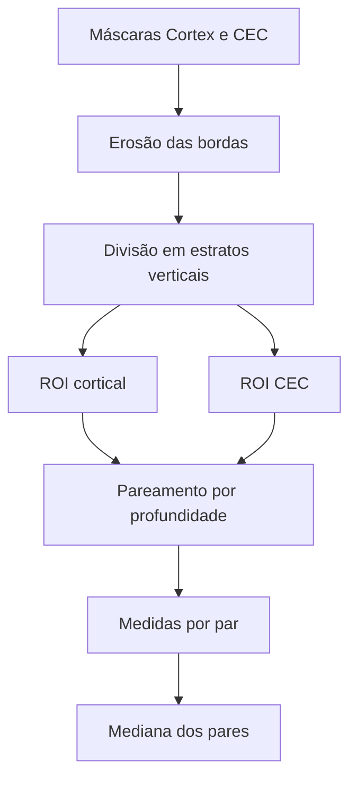

# Ecogenicidade renal quantitativa

[← Wiki](README.md)

## Objetivo desta página

Esta página descreve como o projeto transforma as máscaras anatômicas em **medidas quantitativas de intensidade**.

O foco atual é estudar a relação de brilho entre estruturas renais, principalmente córtex e complexo ecogênico central (CEC), sem transformar essa medida isoladamente em diagnóstico clínico.

## Escopo científico

A ecogenicidade é tratada como um **marcador de imagem exploratório**.

Ela pode ajudar a investigar:

- diferenciação córtico-medular;
- proximidade de brilho entre córtex e CEC;
- heterogeneidade de intensidade;
- possíveis associações futuras com função renal ou histopatologia.

Ela não deve ser usada isoladamente para declarar:

- fibrose;
- DRC;
- IFTA;
- gravidade clínica.

## Regra central

A imagem usada para medir brilho é a **imagem original**, sem CLAHE e sem super-resolução.

Isso é fundamental porque CLAHE altera a distribuição local de intensidades.

### Separação conceitual

```text
imagem processada → modelo de segmentação

imagem original → medida quantitativa
```

## Estruturas envolvidas

As medidas podem usar:

- `Cortex`;
- `Medulla`;
- `Central Echo Complex`.

A comparação prioritária atualmente é córtex × CEC.

## Medidas globais

Se:

- `mu_C` = intensidade média do córtex;
- `mu_M` = intensidade média da medula;
- `mu_CEC` = intensidade média do CEC;

então o sistema pode calcular:

### Razão córtex/CEC

```text
100 * mu_C / mu_CEC
```

Valor próximo de 100% indica médias semelhantes.

### Diferença CEC–córtex

```text
mu_CEC - mu_C
```

Valores menores representam menor separação entre as médias.

### Contraste normalizado

```text
100 * (mu_CEC - mu_C) / (mu_CEC + mu_C)
```

É uma forma adimensional de descrever a diferença relativa.

### Córtex/medula

```text
100 * mu_C / mu_M
```

Pode ser utilizada para estudar diferenciação córtico-medular.

## Por que a medida global não é suficiente

Uma máscara inteira pode incluir regiões:

- muito extensas;
- heterogêneas;
- em profundidades diferentes;
- próximas a bordas;
- com artefatos locais.

Por isso, o protocolo evoluiu para amostragem local pareada.

## Protocolo pareado córtex–CEC

O fluxo atual é:



### 1. Erosão

As máscaras são erodidas com elemento estruturante de 5 × 5 pixels.

Objetivo:

- evitar pixels de fronteira;
- reduzir mistura entre tecidos;
- diminuir impacto de pequenas imprecisões de segmentação.

### 2. Estratos

A região é dividida em três faixas:

- superior;
- média;
- inferior.

O sistema tenta formar até um par de ROIs por faixa.

### 3. ROIs circulares

As ROIs têm:

- mesmo raio;
- mesma área;
- posição interna válida;
- profundidade aproximada semelhante.

O raio é adaptativo, baseado no tamanho da imagem, limitado operacionalmente.

### 4. Pareamento

A ROI cortical é escolhida com coordenada vertical próxima à ROI do CEC.

A coordenada vertical funciona como aproximação de profundidade.

## Medidas por par

Para cada par `i`:

```text
R_i  = 100 * mu_C,i / mu_CEC,i
D_i  = mu_CEC,i - mu_C,i
CN_i = 100 * (mu_CEC,i - mu_C,i) / (mu_CEC,i + mu_C,i)
```

## Resultado principal

A medida principal é a:

```text
mediana(R_i)
```

Também podem ser apresentados:

- IQR;
- número de pares válidos;
- resultado de cada estrato;
- mediana das diferenças;
- mediana do contraste normalizado.

## Por que usar mediana

A mediana reduz a influência de um par isolado com:

- sombra;
- ruído;
- artefato;
- segmentação menos precisa;
- variação local de intensidade.

## Ajuste manual na Curadoria Web

A interface permite visualizar os pares usados no cálculo.

O revisor pode:

- ativar a visualização das ROIs;
- mover as ROIs;
- ajustar sua posição;
- restaurar a seleção automática;
- salvar uma seleção revisada.

As alterações ficam associadas ao revisor.

## Comparador livre A/B

Além do protocolo anatômico, a aplicação possui um comparador livre.

O usuário seleciona dois pontos/ROIs e o sistema calcula:

- razão A/B;
- diferença B–A;
- contraste normalizado;
- diferença vertical;
- dispersão entre pares.

Esse comparador é útil para investigação visual, mas não substitui o protocolo padronizado.

## Limitações da medida

Mesmo sem CLAHE, as intensidades dependem de:

- ganho;
- TGC;
- profundidade;
- compressão;
- equipamento;
- preset;
- pós-processamento;
- posição do transdutor.

Portanto, a ecogenicidade não deve ser tratada como valor absoluto universal.

## Relação com a literatura

A fundamentação do eixo de ecogenicidade está documentada em:

```text
docs/eixo_ecogenicidade_renal.md
docs/revisao_medico_metodologica_fibrose.md
```

Esses documentos discutem estudos sobre:

- córtex/fígado;
- córtex/baço;
- córtex/seio renal;
- relação entre ecogenicidade e função renal;
- limites da interpretação histopatológica.

## Princípio metodológico

> A segmentação produz as regiões anatômicas; a ecogenicidade produz descritores quantitativos dessas regiões. A interpretação clínica continua sendo uma etapa separada.

## Próxima leitura

Para reproduzir o pipeline e os principais scripts, consulte [Execução e reprodutibilidade](execucao-e-reprodutibilidade.md).
