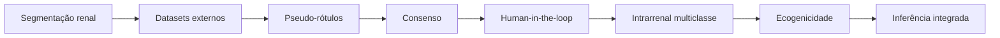

# Histórico metodológico

[← Wiki](README.md)

## Objetivo desta página

O projeto evoluiu rapidamente e alguns documentos refletem decisões anteriores.

Esta página registra as principais mudanças para evitar que um leitor interprete um experimento histórico como se fosse a regra metodológica atual.

## Fase 1 — segmentação renal

O foco inicial era localizar o rim e comparar arquiteturas.

Nessa fase, o problema era essencialmente:

```text
imagem → máscara renal
```

As principais comparações envolveram U-Net, UNet++, DeepLabV3 e SegFormer.

## Fase 2 — expansão da base

A limitação de volume da base supervisionada motivou busca por dados externos.

Foram avaliadas fontes como:

- Kaggle;
- Hugging Face;
- repositórios públicos;
- MONAI/NVIDIA.

A estratégia mudou de “treinar apenas com a base inicial” para “aumentar diversidade preservando proveniência”.

## Fase 3 — pseudo-rotulagem

O modelo renal foi aplicado às imagens externas.

A primeira abordagem utilizou filtros automáticos de qualidade.

Critérios incluíram, em diferentes experimentos:

- confiança;
- área relativa;
- número de pixels;
- componentes conectados;
- concordância entre modelos.

Essa fase mostrou que era possível gerar grande volume de máscaras candidatas.

## Fase 4 — revisão da política de aceitação

A discussão metodológica mostrou um problema:

> alta confiança do modelo não garante que a anatomia esteja correta.

A política passou então de:

```text
filtro automático → aceita
```

para:

```text
filtro automático → prioriza revisão
```

Esse é um dos pontos mais importantes para interpretar o histórico.

## Fase 5 — segmentação de Medulla

Depois da cápsula, o projeto explorou uma segunda etapa para localizar medula.

Foram testados:

- modelos especializados;
- pseudo-rótulos;
- consenso entre modelos;
- expansão controlada do treino.

O experimento mostrou que aumentar o treino com pseudo-rótulos não resultou necessariamente em melhora do teste manual.

Isso reforçou a necessidade de curadoria.

## Fase 6 — modelo intrarrenal multiclasse

A estratégia evoluiu de modelos separados para uma tarefa multiclasse capaz de identificar:

- Cortex;
- Medulla;
- CEC.

Essa mudança tornou a anatomia interna mais coerente e simplificou a inferência.

## Fase 7 — Curadoria Web

A revisão humana deixou de ser apenas uma recomendação metodológica e passou a ter suporte técnico próprio.

Foram implementados:

- interface web;
- visualização de máscaras;
- status por estrutura;
- correção por polígono;
- SQLite;
- histórico;
- exportação.

## Fase 8 — revisão do conceito de fibrose

O projeto inicialmente explorava a possibilidade de usar ecogenicidade como marcador associado a fibrose.

A revisão médico-metodológica mostrou que:

- ecogenicidade não é específica;
- associação com fibrose é limitada;
- diagnóstico requer referência clínica/histológica.

Por isso, a interface passou a usar termos como:

- marcador de anomalia;
- ecogenicidade;
- caracterização quantitativa.

## Fase 9 — ecogenicidade córtex–CEC

A primeira ideia usava médias de regiões completas.

A metodologia evoluiu para:

- excluir bordas;
- usar ROIs pareadas;
- aproximar profundidade;
- calcular mediana entre pares.

A razão global foi mantida apenas como descritor secundário.

## Fase 10 — inferência integrada

A Curadoria Web ganhou um fluxo para nova imagem:

```text
upload
→ cápsula
→ estruturas internas
→ ecogenicidade
```

Isso aproximou o projeto de uma ferramenta demonstrativa de pesquisa.

## Como ler documentos antigos

Ao encontrar um número ou decisão, pergunte:

1. qual dataset foi usado?
2. era máscara manual ou pseudo-rótulo?
3. havia revisão humana?
4. era baseline ou experimento de expansão?
5. qual checkpoint foi usado?
6. essa configuração ainda é a atual?

## Classificação recomendada

Todo resultado deve ser marcado mentalmente como:

### Atual

Representa o fluxo metodológico corrente.

### Baseline

Serve de referência para comparação.

### Histórico

Foi importante durante o desenvolvimento, mas não é mais a configuração principal.

### Exploratório

Testa uma ideia ainda não validada.

### Pendente de curadoria

Depende de revisão humana.

### Não diretamente comparável

Foi obtido com dataset ou protocolo diferente.

## Linha do tempo conceitual



## Por que manter o histórico

Apagar etapas anteriores faria o projeto parecer linear, quando na verdade ele evoluiu por experimentação.

Preservar o histórico permite:

- justificar decisões;
- demonstrar maturação metodológica;
- evitar repetição de experimentos;
- escrever a seção de metodologia da dissertação com maior clareza.

## Próxima leitura

A página [Roadmap e limitações](roadmap-e-limitacoes.md) apresenta os pontos ainda não resolvidos.
