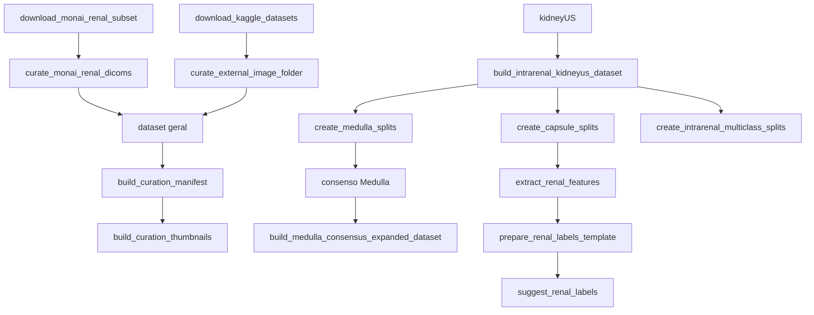

# Scripts de engenharia de dataset

[← Wiki](README.md)

## Visão geral

Os scripts de `engenharia_dataset/` transformam fontes brutas em conjuntos auditáveis para treino, validação, teste e curadoria.

O fluxo conceitual é:

```text
fonte bruta
→ conversão / limpeza
→ manifesto
→ máscaras e ROIs
→ splits supervisionados
→ pseudo-rótulos experimentais
→ curadoria
→ atributos
```

A regra atual do projeto é preservar três coisas em todas as etapas: **origem**, **tipo do rótulo** e **status de revisão**.

---

## `annotate_reference_roi.py`

Ferramenta interativa para produzir máscaras de referência manual.

### Entrada
`dataset_aumentado/dataset_intrarrenal/supervisionado/capsule_annotator_1/`

### Comportamento
A classe `PolygonAnnotator` abre a imagem com OpenCV, recebe cliques do mouse, mantém a lista de vértices, desenha o polígono em tempo real e converte a seleção em máscara binária.

### Saída
`dataset_aumentado/fontes/reference_masks/`

### Quando usar
Quando for necessário criar manualmente uma ROI de referência adicional para uma imagem já conhecida pelo pipeline.

---

## `build_curation_manifest.py`

Constrói o manifesto de entrada da curadoria.

### Entradas padrão
- `dataset_aumentado/dataset_geral/manifest.csv`;
- manifesto das regiões do kidneyUS;
- manifesto de predições de Medulla.

### Comportamento
Cruza imagem consolidada, anotações manuais, predições intrarrenais e caminhos de máscaras. Também cria índices para Medulla manual e prevista e ignora caminhos inexistentes.

### Saída
`dataset_aumentado/curadoria/curadoria_mascaras.csv`

---

## `build_curation_thumbnails.py`

Prepara a camada visual usada pela Curadoria Web.

### Comportamento
Para cada item do manifesto:
1. localiza a imagem;
2. procura rim, córtex, medula e CEC;
3. procura predições multiclasse;
4. valida se imagem e máscara possuem a mesma dimensão;
5. desenha os contornos;
6. salva miniaturas padronizadas;
7. gera um novo manifesto visual.

### Saída
`dataset_aumentado/curadoria/miniaturas_completas/`

A miniatura é apenas para revisão visual; a análise quantitativa continua usando a imagem original.

---

## `build_intrarenal_kidneyus_dataset.py`

Transforma as anotações poligonais do kidneyUS em máscaras e ROIs.

### Fonte
`dataset_aumentado/fontes/kidneyUS_images_25_june_2025/`

### Estruturas
- Capsule
- Cortex
- Medulla
- Central Echo Complex

### Processamento
1. lê os arquivos de anotação;
2. interpreta os polígonos;
3. rasteriza cada estrutura;
4. monta máscaras por classe e anotador;
5. calcula a ROI definida pela cápsula;
6. adiciona margem configurável;
7. recorta imagem e máscaras;
8. calcula Dice entre anotadores;
9. gera previews;
10. salva manifestos.

### Parâmetros importantes
- `--pad-ratio`: margem ao redor da cápsula;
- `--preview-count`: número de exemplos visuais;
- `--clear-output`: recria a saída.

### Saída
`dataset_aumentado/dataset_intrarrenal/intermediario/kidneyus_regions/`

---

## `create_capsule_splits.py`

Cria o dataset supervisionado de cápsula.

### Comportamento
O script agrupa imagens por paciente/exame inferido do nome do arquivo e cria treino, validação e teste sem espalhar imagens do mesmo grupo entre splits distintos.

### Padrão
- teste: 15%;
- validação: 15%;
- seed: 42;
- anotador: `annotator_1`;
- materialização: hardlink.

### Saída
`dataset_aumentado/dataset_intrarrenal/supervisionado/capsule_annotator_1/`

---

## `create_medulla_splits.py`

Cria datasets binários supervisionados de estruturas internas.

### Comportamento
1. filtra imagens com máscara válida;
2. agrupa para evitar vazamento;
3. separa treino/validação/teste;
4. materializa imagem, máscara e manifesto.

### Parâmetros
- `--target`: estrutura alvo;
- `--annotator`;
- `--test-ratio`;
- `--val-ratio`;
- `--link-mode`.

Foi usado para criar os conjuntos de Medulla e Cortex.

---

## `create_intrarenal_multiclass_splits.py`

Cria a base multiclasse intrarrenal.

### Classes
```text
0 = background
1 = Cortex
2 = Medulla
3 = Central Echo Complex
```

### Comportamento
Combina as máscaras binárias em uma única máscara de classes inteiras, separa por paciente e ainda contabiliza a distribuição de pixels por classe.

### Saída
`dataset_aumentado/dataset_intrarrenal/supervisionado/regions_multiclass_annotator_1/`

---

## `create_dataset_geral_splits.py`

Cria o protocolo de validação cruzada da base expandida.

### Entrada
`dataset_aumentado/dataset_geral/`

### Padrão
- teste final fixo: 30%;
- desenvolvimento: 70%;
- folds: 5;
- seed: 42.

### Saída
```text
dataset_aumentado/dataset_geral_cv/
└── folds/
    ├── fold_01/
    ├── ...
    └── fold_05/
```

O teste final permanece fixo entre os folds.

---

## `build_medulla_consensus_expanded_dataset.py`

Constrói um treino expandido de Medulla baseado em consenso.

### Comportamento
1. copia/hardlinka o treino manual;
2. lê candidatos produzidos por DeepLab e ROI-UNet;
3. remove imagens duplicadas por hash;
4. mede Dice entre modelos;
5. mede razão Medulla/rim;
6. mede número de componentes;
7. mede a fração do maior componente;
8. adiciona apenas candidatos dentro das regras;
9. preserva validação/teste manuais;
10. gera folhas de auditoria.

### Regras padrão
- Dice para revisão: >= 0,75;
- Dice para treino: >= 0,78;
- Medulla/rim: >= 0,10;
- máximo de componentes: 3;
- maior componente: >= 80% da máscara.

### Importante
O conjunto gerado é experimental. Os filtros automáticos não transformam o pseudo-rótulo em anotação clínica.

---

## `download_monai_renal_subset.py`

Baixa o MONAI/NVIDIA em lotes controlados.

### Fluxo
1. baixa os metadados globais;
2. procura `RENAL`, `RETROPERITONEAL` e `KIDNEY`;
3. estima o tamanho dos ZIPs;
4. ignora estudos já processados;
5. seleciona um lote limitado por GB;
6. baixa os arquivos.

### Parâmetro central
`--max-gb`, padrão 2 GB.

A estratégia permite repetir:
```text
baixar → converter → validar → apagar bruto → próximo lote
```

---

## `curate_monai_renal_dicoms.py`

Converte DICOMs do MONAI em PNG B-mode.

### Comportamento
Para cada DICOM:
1. lê diretamente do ZIP;
2. verifica dimensões;
3. identifica se é cine;
4. rejeita RGB/colorido por padrão;
5. escolhe até 3 frames representativos;
6. normaliza para uint8;
7. grava PNG;
8. preserva metadados;
9. registra aceitação ou motivo de rejeição.

### Padrão
- até 3 frames por DICOM;
- mínimo 256×256;
- RGB ignorado salvo opção explícita.

---

## `download_kaggle_datasets.py`

Automatiza datasets configurados no Kaggle.

### Configuração
`config/kaggle_datasets.csv`

### Comportamento
- verifica CLI do Kaggle;
- verifica `kaggle.json`;
- filtra datasets habilitados ou slugs pedidos;
- cria pastas por slug;
- baixa e opcionalmente descompacta.

### Saída
`dataset_aumentado/fontes/external_data/raw/`

---

## `curate_external_image_folder.py`

Adaptador genérico para datasets externos que já vêm como arquivos de imagem.

### Entrada obrigatória
- `--input-dir`
- `--dataset-name`

### Comportamento
- percorre imagens comuns;
- valida resolução;
- identifica se a imagem é aproximadamente grayscale;
- converte para uma representação B-mode padronizada;
- gera manifesto e resumo.

### Padrão
- largura mínima 128;
- altura mínima 128.

---

## `expand_dataset_from_loader.py`

Representa o primeiro fluxo de pseudo-rotulagem do projeto.

### Modos
- gerar pseudo-máscaras;
- construir base expandida;
- executar tudo.

### Filtros
- confiança mínima;
- pixels de foreground;
- área relativa;
- pós-processamento morfológico.

### Interpretação
É um fluxo histórico. Os critérios automáticos servem para experimentação e priorização, não para declarar ground truth.

---

## `divisor_segmentation.py`

Triagem legada do antigo `dataset_loader`.

### Fluxo
1. remove bordas pretas;
2. limpa a imagem;
3. normaliza;
4. roda o modelo;
5. aplica threshold;
6. mantém o maior componente;
7. calcula confiança;
8. separa em identificada/não identificada.

### Status
Mantido como histórico do pipeline inicial.

---

## `extract_renal_features.py`

Extrai descritores quantitativos do rim.

### Comportamento
1. lê imagem e máscara renal;
2. carrega opcionalmente referência manual;
3. chama `utils/renal_features.py`;
4. extrai intensidade, textura, pontos brilhantes e razões;
5. gera máscaras candidatas;
6. produz painéis de depuração;
7. salva CSV de features.

### Saída
`results/renal_feature_analysis/`

---

## `prepare_renal_labels_template.py`

Cria `renal_labels.csv` a partir da lista de imagens em `renal_features.csv`, preparando o preenchimento de rótulos do classificador tabular.

---

## `suggest_renal_labels.py`

Gera sugestões provisórias de classe com base nos extremos das features.

### Estratégia
- casos com score alto → candidato alterado;
- casos com score baixo → candidato preservado.

Esses valores são apenas sugestões para revisão humana.

---

## Relação entre os scripts


