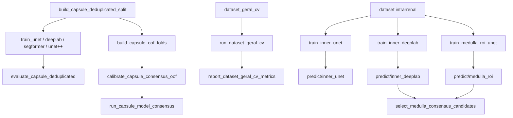

# Scripts de segmentação, treino e avaliação

[← Wiki](README.md)

## Visão geral

A pasta `src/segmentation/` concentra o núcleo experimental do projeto. Ela contém preparação do benchmark, treinamento, busca de hiperparâmetros, consenso, inferência, pós-processamento e avaliação.

---

## Preparação da cápsula

### `build_capsule_deduplicated_split.py`

Cria o benchmark de cápsula sem duplicação.

**Processamento**
- calcula SHA-1;
- agrupa imagens duplicadas;
- extrai ID do exame pelo padrão `IM-...`;
- escolhe uma máscara representativa por medóide quando há múltiplas máscaras;
- distribui por exame entre treino/validação/teste;
- gera manifesto e auditoria.

**Padrão:** 70% treino, 15% validação, restante teste, seed 42.

Esse script sustenta o benchmark deduplicado usado no artigo.

---

### `build_capsule_oof_folds.py`

Cria os folds out-of-fold usados no consenso.

**Processamento**
- coleta registros;
- agrupa por exame;
- balanceia grupos em 5 folds;
- cria treino e validação dentro de cada fold;
- materializa os arquivos.

A finalidade é garantir que o score de consenso seja calibrado em imagens não vistas pelo modelo correspondente.

---

### `build_dataset_geral.py`

Consolida kidneyUS e fontes externas em uma visão única.

**Fluxo**
1. coleta candidatos;
2. remove duplicatas por hash;
3. gera IDs únicos;
4. copia imagem em resolução original;
5. copia máscara existente;
6. em imagem sem máscara, prepara tensor;
7. executa modelo;
8. aplica CLAHE se configurado;
9. pode combinar predição original e espelhada;
10. aplica threshold;
11. mantém maior componente;
12. calcula confiança/consistência;
13. salva máscara candidata;
14. registra relatórios e fila de revisão.

**Modelos suportados**
U-Net, UNet++, DeepLabV3 e SegFormer.

**Saída atual:** `dataset_aumentado/dataset_geral_v2/`.

No fluxo atual, pseudo-máscaras externas ficam pendentes de revisão.

---

## Calibração e consenso

### `calibrate_capsule_review.py`

Executa o modelo em um split manual e calcula valores de referência operacionais para priorização da revisão. O percentil de referência padrão é 5%.

Esses limiares descrevem o comportamento do modelo em dados manuais; não validam anatomia automaticamente.

---

### `calibrate_capsule_consensus_oof.py`

Lê resultados dos folds OOF e resume a distribuição do Dice entre U-Net e DeepLabV3. A partir dela, deriva thresholds arredondados usados na classificação de consenso.

---

### `run_capsule_model_consensus.py`

Roda U-Net e DeepLabV3 na mesma imagem externa.

```text
imagem
→ máscara U-Net
→ máscara DeepLabV3
→ Dice entre máscaras
→ categoria de consenso
→ prioridade de revisão
```

**Thresholds padrão**
- 0,89: faixa intermediária;
- 0,94: consenso alto/rotina.

Também gera CSVs e figuras qualitativas.

---

## Avaliação da cápsula

### `evaluate_capsule_deduplicated.py`

Avalia U-Net, UNet++, DeepLabV3 e SegFormer no teste deduplicado.

Calcula Dice, IoU, precisão e recall e também produz figura qualitativa com referência e predição.

É a fonte principal das métricas consolidadas de cápsula no artigo.

---

## Núcleo de treinamento

### `core/dataset.py`

Define `KidneyDataset`.

**Responsabilidades**
- localizar imagens e máscaras;
- redimensionar;
- aplicar CLAHE;
- aplicar augmentation;
- converter para tensor;
- entregar imagem/máscara ao DataLoader.

---

### `core/losses.py`

Implementa:
- Dice loss;
- Tversky;
- focal loss;
- focal-Tversky.

Essas perdas podem ser combinadas pelo motor de treinamento.

---

### `core/metrics.py`

Implementa Dice e IoU para predições binárias, aceitando logits ou probabilidades e threshold configurável.

---

### `core/model_loader.py`

Centraliza:
- aliases dos modelos;
- nomes amigáveis;
- checkpoints padrão;
- carregamento de U-Net, UNet++, DeepLabV3 e SegFormer.

Evita que cada ferramenta implemente sua própria lógica de loading.

---

### `core/segmentation_training.py`

É o motor comum de treino binário.

**Faz**
- seed;
- DataLoaders;
- otimizador Adam/AdamW;
- scheduler plateau/cosine;
- early stopping;
- loss configurável;
- cálculo automático de `pos_weight`;
- busca de threshold;
- seleção de melhor época;
- avaliação;
- gravação de histórico;
- checkpoint;
- resumo JSON.

**Parâmetros importantes**
`--epochs`, `--batch-size`, `--lr`, `--optimizer`, `--scheduler`, `--loss`, `--threshold`, `--augment`, `--clahe`, `--seed`.

---

### `core/segmentation_evaluation.py`

Implementa o avaliador genérico de modelos binários com:
- Dice;
- IoU;
- precisão;
- recall;
- F1;
- Hausdorff.

---

## Treinos de cápsula

### `experiments/train_unet.py`
Define a U-Net clássica e chama o motor genérico.

### `experiments/train_unetplusplus.py`
Define a UNet++ e reutiliza o mesmo motor.

### `experiments/train_deeplab.py`
Cria DeepLabV3 com ResNet50 ou ResNet101.

### `experiments/train_segformer.py`
Carrega SegFormer e adapta a saída à tarefa binária.

---

## Busca experimental

### `experiments/run_hyperparameter_search.py`

Executa uma grade de configurações por modelo para comparar capacidade, resolução, loss, learning rate e regularização.

### `experiments/run_quality_search.py`

Busca configurações focadas em qualidade e avalia thresholds de 0,25 até 0,80.

### `experiments/run_dataset_variant_comparison.py`

Compara o mesmo modelo em diferentes versões do dataset, permitindo separar o efeito do dado do efeito da arquitetura.

### `experiments/compare_quality_with_pure_models.py`

Compara o melhor resultado de cada família na busca de qualidade com as configurações “puras”/baseline da mesma arquitetura.

### `experiments/compare_with_kidneyus_reference.py`

Compara resultados locais com resultados/artefatos de referência do kidneyUS/nnU-Net quando disponíveis, agregando métricas e produzindo tabelas.

---

## Validação cruzada do dataset geral

### `experiments/run_dataset_geral_cv.py`

Treina DeepLabV3 nos folds de `dataset_geral_cv`.

**Padrão**
- 5 folds;
- 30 épocas;
- batch 8;
- 256×256;
- LR 1e-4;
- augmentation ativo;
- early stopping 8.

Consolida os resultados de todos os folds.

### `tools/report_dataset_geral_cv_metrics.py`

Transforma os resultados da validação cruzada em artefatos de relatório:
- CSV;
- JSON;
- curvas;
- relatório Markdown;
- agregados por fold.

---

## Segmentação intrarrenal

### `experiments/train_inner_unet.py`

Treina U-Net multiclasse para:
- background;
- Cortex;
- Medulla;
- CEC.

**Padrão**
50 épocas, batch 8, LR 1e-4, CLAHE e augmentation ativos.

---

### `experiments/train_inner_deeplab.py`

Treina DeepLabV3 multiclasse nas mesmas quatro classes.

Usa entropia cruzada + Dice multiclasse e calcula métricas por estrutura.

---

### `experiments/train_medulla_roi_unet.py`

Treina uma U-Net especializada em Medulla ou Cortex.

**Entrada de 3 canais**
1. ROI em grayscale;
2. ROI mascarada pelo rim;
3. máscara renal.

A saída é restringida ao interior do rim.

---

## Inferência intrarrenal

### `tools/predict/inner_unet.py`

Aplica a U-Net multiclasse sobre o `dataset_geral`.

**Fluxo**
- lê imagem;
- carrega máscara renal;
- calcula bounding box com margem;
- cria ROI;
- executa modelo;
- reconstrói a predição na resolução original;
- calcula estatísticas por classe;
- salva máscaras, previews e manifesto.

---

### `tools/predict/inner_deeplab.py`

Executa o mesmo fluxo com a DeepLabV3 multiclasse.

---

### `tools/predict/inner_samples.py`

Gera amostras qualitativas no próprio conjunto supervisionado da U-Net intrarrenal.

Calcula Dice por classe e cria overlays de comparação com o alvo.

---

### `tools/predict/medulla_roi.py`

Aplica um modelo binário especializado de Medulla ou Cortex sobre o `dataset_geral`.

**Arquiteturas**
- DeepLab;
- ROI-UNet.

**Filtros**
- razão mínima/máxima da estrutura em relação ao rim;
- ROI renal obrigatória;
- limite de quantidade via `--limit`.

Gera pseudo-máscaras candidatas e previews.

---

## Avaliação de Medulla

### `tools/evaluate_pyramid_heuristic.py`

Compara a antiga heurística de regiões escuras com a máscara manual de Medulla.

Produz Dice, IoU, precisão e recall e funciona como baseline mínimo.

---

### `tools/evaluate_medulla_stability.py`

Avalia a cascata completa.

Compara:
- ROI manual × ROI renal prevista;
- Medulla manual × Medulla prevista;
- DeepLab × ROI-UNet;
- medidas de intensidade dentro das máscaras.

Também calcula estabilidade de médias e razões de intensidade.

---

### `tools/select_medulla_consensus_candidates.py`

Cruza as predições de DeepLab e ROI-UNet.

**Processamento**
- lê os dois manifestos;
- calcula Dice entre máscaras;
- seleciona candidatos acima do threshold;
- identifica casos de fronteira;
- gera painéis de auditoria.

O padrão de seleção é Dice >= 0,75.

---

## Comparações qualitativas

### `tools/compare/inner_models.py`

Compara U-Net e DeepLab multiclasse imagem a imagem, mede Dice por classe e gera painéis dos casos de maior divergência.

### `experiments/visual_compare_segmenters.py`

Gera uma figura comparando referência, modelos locais e, quando disponível, predições externas/nnU-Net.

### `tools/compare/unet_preprocess.py`

Testa o efeito do pré-processamento sobre a U-Net de cápsula.

Pode comparar:
- original;
- CLAHE;
- super-resolução;
- combinações.

Calcula Dice/IoU por variante e gera painéis.

---

## Ferramentas de pós-processamento

### `tools/post/clean_kidney.py`

Analisa máscaras renais existentes, identifica componentes conectados e mantém o maior componente quando necessário. Pode rodar em `--dry-run`.

### `tools/post/constrain_inner.py`

Garante que máscaras intrarrenais permaneçam dentro da máscara renal. Pode processar múltiplos manifestos de predição.

---

## Predição de rim em imagens faltantes

### `tools/predict/missing_kidney.py`

Aplica um checkpoint às imagens do `dataset_geral` que ainda não possuem máscara.

**Filtros**
- confiança;
- área relativa;
- pixels positivos;
- número de componentes.

Também pode testar CLAHE e super-resolução Lanczos.

Historicamente, máscaras que passavam nesses filtros eram materializadas. Na política atual devem ser tratadas como candidatas até revisão.

---

## Referências externas

### `tools/segment_external_reference_images.py`

Aplica o segmentador renal a imagens externas usadas como referência visual.

Gera:
- máscaras;
- painéis;
- manifesto;
- classificação baseada na pasta de origem.

É útil para avaliar comportamento fora do dataset principal, mas não entra automaticamente no treino.

---

## Ferramentas de benchmark

### `tools/benchmark_models.py`

Avalia múltiplos checkpoints com métricas completas, incluindo Hausdorff.

### `tools/evaluate_models.py`

Versão mais simples de avaliação comparativa, reutilizando a infraestrutura de modelos e dataset.

### `tools/generate_prediction_samples.py`

Gera exemplos de predição U-Net/DeepLab para inspeção visual.

### `tools/visualizar_resultados.py`

Ferramenta legada para overlays e heatmaps de modelos antigos. Deve ser lida como utilitário histórico de visualização.

---

## Relação dos componentes


